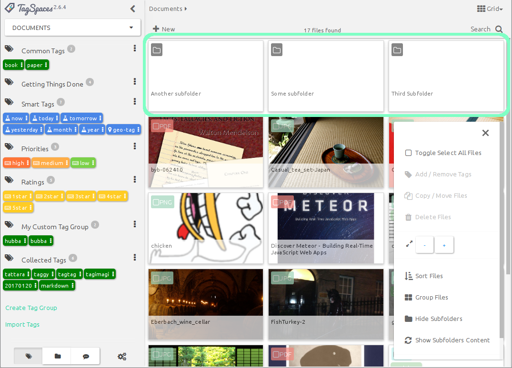

# Browsing Your Files

When you navigate to a folder in your active location, the files contained in the selected folder will be displayed on the main file browsing area of the user interface. TagSpaces offers flexible views to display your files. These views are called **perspectives**.

## Perspectives overview

Perspectives are not an integral part of TagSpaces, but exist as modular extensions. This modular approach allows for more flexibility, easier development, and customizability of each separate perspective. By default, there are four perspective extensions included in TagSpaces, which are:

* [List Perspective](extensions/perspectiveList.html) - Presenting your files as list, optimized for simple file management.

* [Grid Perspective](extensions/perspectiveGrid.html) - Presenting your files as grid of thumbnails, if enabled. Unlike the List Perspective, the grid can also display folders.

* [ImageSwiper Perspective](extensions/perspectiveImageSwiper.html) - A perspective optimized for browsing and viewing image files. Best used with photo or image folders.

* [FolderViz Perspective](extensions/perspectiveGraph.html) - This is an experimental perspective which applies some information visualization concepts to presenting your folder and file structures.

## Choosing a perspective

## List perspective

The most common way of presenting files in a folder is in a list format. In the **List Perspective** files are represented as rows of a list, similar to the default view of most file browsing applications.

Each row of the list consists of columns, which give specific information about the files. The column names can be found in the header row, at the top of the list.

The columns, from left to right are:

* **File extension**  -  A color coded icon, representing the file type. Scroll down to [Common features -> Color coded file extensions](#color-coded-file-extensions) to learn more about this feature.

    Underneath the file extension icon, there is also a checkbox, which can be used to easily select one or more files. This also means that `Ctrl or Shift + click` will **not** work for selecting multiple files in the current version of TagSpaces, although this functionality is planned for a future release.

* **Title** - The file's title is the filename without the extension or any tag information. By default, TagSpaces stores tags as part of the filename. To learn more about how this is achieved, see the [Tagging](tagging.md) section.

* **Tags** - All the tags that are applied to the file will appear here, with the right background and font color. To learn more about tag colors, refer to the [User interface -> Tag Library](userinterface.md#tag-library) section.

* **Size** - This is the file size in a human readable format.

* **Date modified** - The time the file had been last modified, in a format of `YYYY.MM.DD-hh:mm:ss`

To change the list order, you can click the list column headers. For example if you want to sort the list alphabetically by name *(A-Z)*, click on the name. To change the direction of the sorting *(Z-A)*, click on the name again. Each header offers bidirectional sorting based on its column's contents.

>**Hint:** Although there is currently no indicator of either the direction, or the active sorting mode, this feature will be added in a future release of TagSpaces.

### List overflow menu options

The **Floating Action Button** (FAB) at the bottom right corner, hides a contextual overflow menu applicable for the currently active perspective. The List perspective offers its own set of options, that will allow you to manage the list of files in certain ways.

* **Toggle Select All Files** will mark every file on the list as selected or unselected.

* **Add/Remove tags**  will allow you to manage tags on selected files. (This options is only available when there is an active selection, and works on multiple files simultaneously.) To learn more about how tagging works, refer to the [Tagging -> Tagging using context menus](tagging.md/tagging-using-context-menus) section.

* **Copy/move files** will allow you to copy or move one or more selected files. (This option is only available when there is an active selection, and works on multiple files simultaneously.) Selecting this option will present you with the **Move or Copy File(s)** dialog. After specifying the target directory (which can be anywhere on the file system, even outside your connected locations), you can choose to move or copy the file(s) by pressing the corresponding button.

* **Delete files** will allow you to delete the file(s) selected. (This option is only available when there is an active selection, and works on multiple files simultaneously).

    ><i class="profeature">pro</i> **Hint**: TagSpaces PRO offers an option to move deleted items to trash bin instead of deleting them permanently. To learn more about how to activate this feature, refer to the [Settings -> PRO features](settings.md/#pro-features) section.

* **Show subfolders content** - If you don't care about folder structure, or do not know where in the hierarchy you would find a necessary file, you can turn this option on, to show every file from all subfolders recursively, starting from your current directory. The list will display all files in order, without any indication of their actual locations. This option will allow you to work with multiple files across a folder hierarchy at once.

* **Export to CSV** will create a **Comma Separated Variable** from all displayed files, be it from the current folder, or from the full folder hierarchy, and save it n a folder of your choice. The generated CSV contains `path,title,size,tag1, tag2,tag3,...`, where each new line represents a separate file.

* **About** will display information about the perspective extension in a pop-up window.

## Grid perspective

An alternative arrangement, commonly found in file browsing applications is the grid. In TagSpaces the **Grid Perspective** offers a resizeable grid with thumbnail previews of certain file formats, for quick and effective browsing.

Each card on the grid has three main components. The main body of the card shows a thumbnail preview of the file (if available), the bottom area displays the filename, the color coded icon in the top left corner represents the file extension, with a checkbox for selecting the file. Underneath the file extension icon, the applicable tags are displayed. In this view, there is no information given about file sizes, or last modified dates.

The file extension, and the tags are dimmed on the cards by default, which might render them unreadable, when there is a file preview available. To improve readability, hover your mouse over the extension, or the tags to make them more opaque.

### Grid overflow menu options

Just like the List perspective, the grid also offers a specific set of options, found in the overflow menu, which can be accessed by pressing the FAB.

Some options (such as *Add/Remove Tags*, *Copy/Move Files*, *Delete Files*, *Show Subfolder Content*, and *About*) are identical to those of the List Perspective. The **Grid Perspective** specific specific options, which allow you to interact with the view are:

* **Change card size** - by pressing the *plus*  and *minus*  buttons, you can change the size of the cards displayed on the grid.

* **Sort Files** will present you with different options to sort files by.

* **Group files** allows for grouping based on time (either stamp tags, or last modified date accessed from the file itself), or by any defined tag groups. This will allow tag groups to serve as a basis for file grouping. (To learn more about tag groups, refer to [User Interface -> Tag Library](userinterfaces.md#tag-library) section.

* **Show subfolders** will allow you to display folders as part of the grid, in addition to files. It enables a more intuitive way for navigating through folders, which is common in file managers found in most modern operating systems. It has been implemented as an experimental feature in the grid perspective, and as such, it is is not yet enabled by the default.

    >**Hint:** The List perspective will also receive this functionality in the future.

## Common features

Besides the very specific functionality and features List and Grid perspectives offer, there are some common characteristics that are uniform across the two.

### File context menu

The file context menu can be accessed by right-clicking a file in either perspective. It will offer some common file management options.

* **Open file** This will split the main area of TagSpaces into two, and open the file in the right pane. TagSpaces offers viewers for various file types, which can be opened inside the application. To learn more bout supported types, refer to the [Viewing Files](viewing-files.md) section.

* **Open File Natively** you have the option to open files that are unsupported by TagSpaces,  in whatever application is associated with the file type in your operating system.

* **Open Containing folder** will open the folder containing the selected file, in the operating system's default file manager application.

The other common file management options *(Add/Remove tags, Copy/Move Files, Delete Files, Show Subfolder Content)* are identical to what you can find in the perspectives' overflow menu.

### Drag to move file

#### Drag to move within TagSpaces

An alternative way to move files into another folder is to drag its color coded file extension icon onto a folder on the **Folder navigation** widget on the left panel. When the folder lights up with a yellowish hue, just release the icon, and the file will be immediately moved into that folder.

> **Hint:** You can access subfolders of any folder displayed in the hierarchy, by clicking the black folder icon next to its name. For more details, refer to the [User interface -> Folder Navigation](userinterface.md#foldder-navigation) section.

#### Drag from outside, and drop into TagSpaces

Besides dragging files from the **File Browser Area** to a subfolder, TagSpaces allows you to add files and folders to a listed **Location** by dragging and dropping it from the operating system, or any other file browsing application.

To do this, just grab a file icon with your mouse, and drag it to TagSpaces' file browsing area.

>**Hint:** This feature also works in the ImageSwiper perspective

### Color coded file extensions
In the grid and list perspectives, color coded file extensions are supported, allowing for a better visual recognition of the file type. For the most common file extensions, custom colors have been defined, to be displayed on the extension buttons found on the file rows or cards.

This feature can also be turned off. To disable it, go to the *General* tab of *Settings* and turn off the *Enable colored file type extensions* checkbox.

> **Hint:** There are plans to make the colors for the extensions configurable in a future release.

## ImageSwiper perspective

The **ImageSwiper Perspective** will turn any folder that contains images, into a picture gallery. This perspective only displays image files, and simply ignores all other files in the folder, therefore this perspective is only suitable for folders that contain mainly images.

> **Hint:** For now, the thumbnail size of the images displayed in the gallery is fixed.

### ImageSwiper overflow menu

The overflow menu offers two options:

* **Change gallery background** will allow you to choose between *white*, *black* and *sepia* colored background for the image gallery.

* **About** will display information about the extension.

### Displaying images

Whereas image files opened in the List or Grid perspectives will open the file in the right panel (learn more about viewing files in the [Viewing Files](viewing-files.md) section), the **ImageSwiper Perspective** will open images in a classic light-table style preview, that takes up all of the applications interface.

Upon hovering the mouse over the image, various controls appear. In the upper-right corner, you will find a position indicator, stating the number of the image, out of a total number of images found in the folder (**1**). To the left and right of the image are navigation controls to swipe left to navigate to the previous image (**2**), and right, to navigate to the next image (**3**). In the upper-right corner, you will find a button to zoom in or out (**4**), display the image preview in full-screen mode (**5**), and close the preview (**6**) to return to the gallery.

> **Hint:** As its name indicates, the ImageSwiper Perspective fully supports (left or right) swipe gestures for navigation in the preview mode, on devices that allow for this. You can also drag the images with the mouse pointer, to imitate the swipe gesture on devices that are not touch enabled.

### Generating live thumbnails for photos

In the Grid and ImageSwiper perspectives TagSpaces generates thumbnails for JPG and PNG files on the fly. These small image previews are not persisted on your system, so every time you open a folder they will be regenerated. TagSpaces generates thumbnails only for image files which are currently visible in the application.

## FolderViz Perspective

The **FolderViz Perspective** is a collection of experimental views hat apply some information visualization concepts to representing your files and folders. While the primary aim of FolderViz perspective is to showcase TagSpaces' capabilities to developers, some of the options might offer some useful features to the end users.

**Note: FolderViz Perspective is an experimental feature, which can be *very* memory intensive on large folder structures, and can easily lock up one's computer. It is disabled by default on Android and Webdav, and will be disabled by default in all variants of the next version of TagSpaces.**

**FolderViz Perspective** currently offers five types of views, which can be accessed from the FAB menu:

### MindMap View

**MindMap** will display all folders and subfolders contained within the current directory, in an expandable tree-node format. There are plans to extend this view in the future with an inverted graph of tags so you can navigate your tagged files, with the help of the tag group three instead of the folder tree, and drag and drop files from one branch of tag tree to some other branch, which will automatically re-tag them.

### Tree View

**Tree** will display a fully expanded tree, similar to **MindMap**, only not interactive. It can be useful to visualize folder hierarchy, but this view can have performance issues with large directory structures.

### TreeMap View

**TreeMap** offers a representation of all files and folders, where the size of the squares correspond to file sizes, relative to the root and each other, while the structure of the squares represents folder hierarchy.

### TreeMap-Navi View

**TreeMap Navi** is just like TreeMap, but without the hierarchy. here the squares fully use up the available User Interface, allowing for a better visual representation of relative file sizes. This can be useful for finding large files or folders.

### Bilevel Partition

**Bilevel Partition** is the most experimental and least functional of all views, basically a test to push the capabilities of folder and file visualization. While it might produce some interesting looking results, it will most certainly be removed from a future release of TagSpaces.

