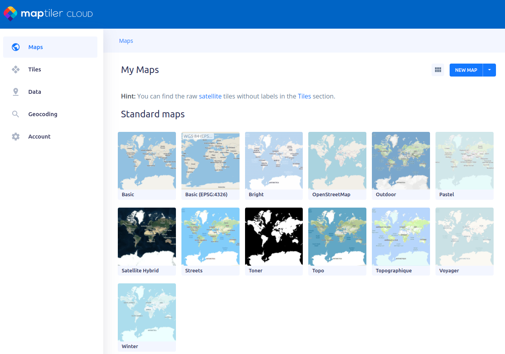

import { ProFeature, CenteredImage, CenteredVideo } from '@site/src/components/CommonBlocks';

<ProFeature />

:::info
This article is work in progress
:::

TagSpaces uses the free OpenStreetMap service as a default digital map. It works fine for the most of the cases, but since the service is free, they can not guaranty that it we always accessible and that it can serve all the request coming to it. Depending on this how much you relay on the digital maps in TagSpaces, it might make sense to configure an alternative map tile server solution. They are many such services available online and we found [Maptiler](https://www.maptiler.com/) to be one which is very reliable, easy to configure and offering many map themes. Of course everything comes with its price, luckily they offer a free plan so you can try it with no costs. Another option you have is to setup your own map tiles server. I will discuss this option briefly at the end of the second half of this tutorial.

## Using map tiles from Maptiler

In order to start with Maptiler you will need to [create an account](https://www.maptiler.com/cloud/plans/) for this service.

https://cloud.maptiler.com/geocoding/

## Setting up your own map tile server

<!--  -->

DockerImage

https://github.com/Overv/openstreetmap-tile-server

https://hub.docker.com/r/overv/openstreetmap-tile-server

http://download.geofabrik.de/

## Adding map tile servers in TagSpaces

<!-- 

 -->
