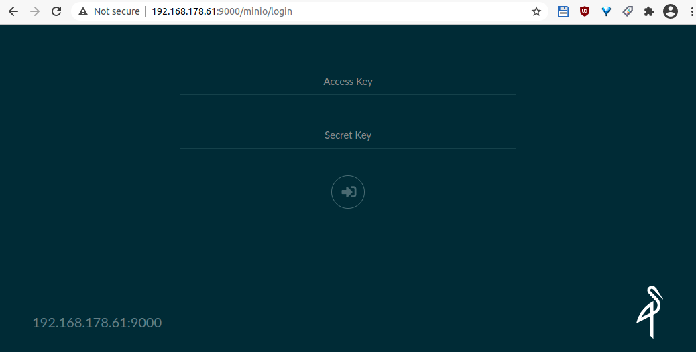
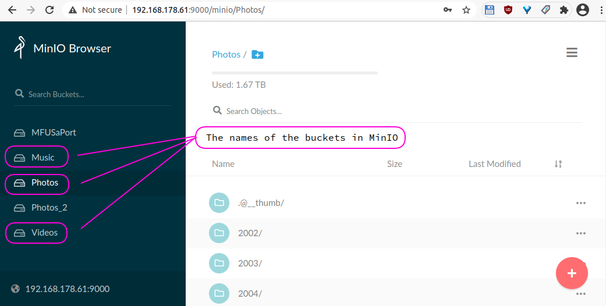
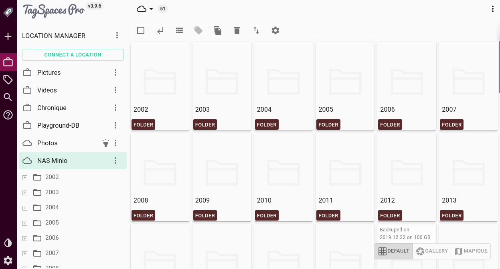

This article will guide through the setting up of a self hosted object storage based on MinIO for Synalogy and QNAP based NAS systems. Then we will show you how to setup the TagSpaces PRO Web on a web server and connect it to the MinIO server.

## Setup Minio on QNAP NAS

> Work in progress

The easies way to run it is with the container app, which run Docker in background. This can be done by opening a ssh-shell to your NAS and executing the following command:

    $ docker run -d \
        --restart=always \
        -p 9000:9000 \
        --name qnap-s3-minio \
        -e MINIO_ROOT_USER=your_minio_user_name \
        -e MINIO_ROOT_PASSWORD=some_very_secret_key \
        -v /share/DataS3:/data \
        minio/minio server /data

Notes:
* --restart=always ,ake sure Minio docker image is started automatically after restarting your NAS system
* -p 9000:9000/tcp will expose MinIO server on both network interfaces (port 9000 tcp)
* MINIO_ROOT_USER and MINIO_ROOT_PASSWORD must be changed for production
* /share/DataS3 is local directory on QNAP NAS
* /data is the folder which is mapped to /share/DataS3 and which is later server by the minio
* minio/minio is Docker image available at Docker Hub

## Setup Minio on Synology NAS

### Check if Minio is installed correctly

Open a web browser and navigate to the URL where the MinIO is hosted.

And after login it should like this:

## Configure TagSpaces Pro

Create new cloud location by clicking the **Connect a location** button. In the dialog select **Object Storage** radio box and click **advanced mode** button on the bottom of this dialog. Here you will need to enter the following information:

- Location name - free text allowing you later to recognize the location in the location manager
- Location path - should be left empty, it is currently not supported by TagSpaces for MinIO connections
- Access key - here you should enter the access key MinIO user
- Secret access key - here is the place for the secret access key of the user
- Bucket name - here you should name of one of the subfolder in main folder hosted by MinIO (see the previous screenshot)
- Endpoint URL - the url with with the port where you MinIO instance is running
- Location ID - is automatically generated but can be changed to another unique id if needed, you should not leave it empty.

Once you have configured the location and saved the changes, TagSpaces should connect to it list the files in it.

