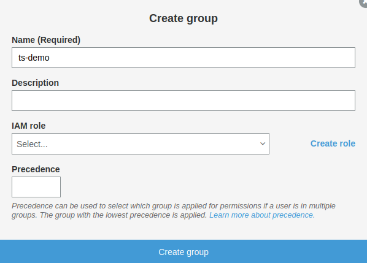
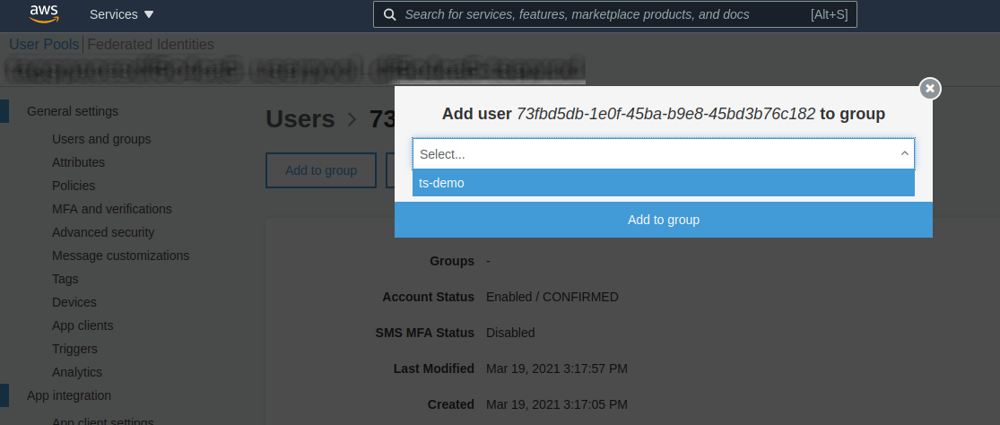
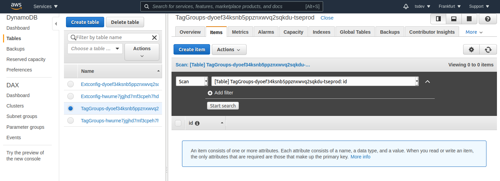
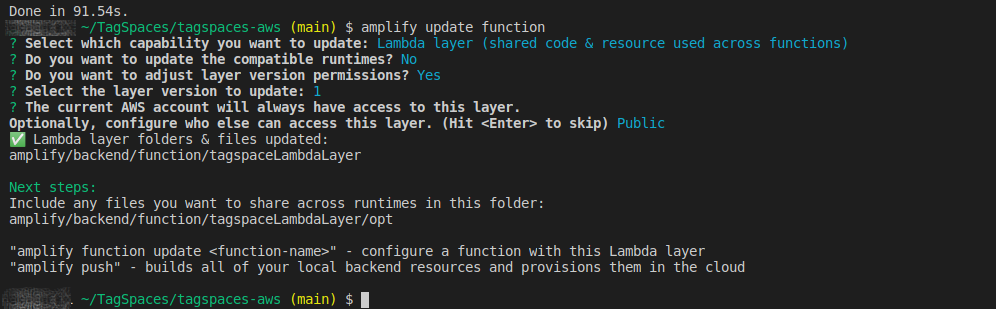
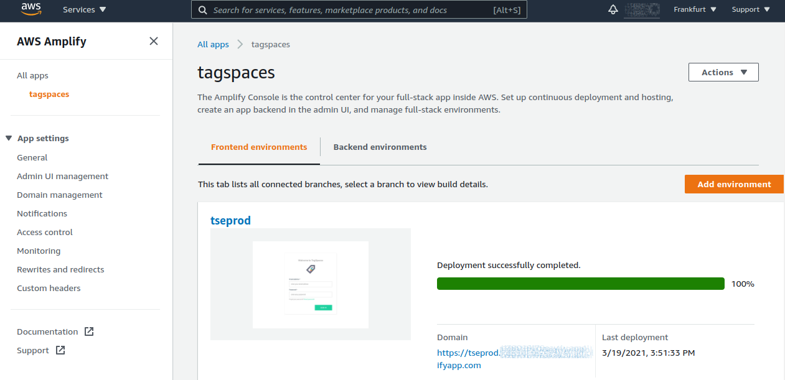
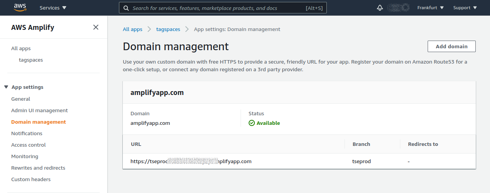
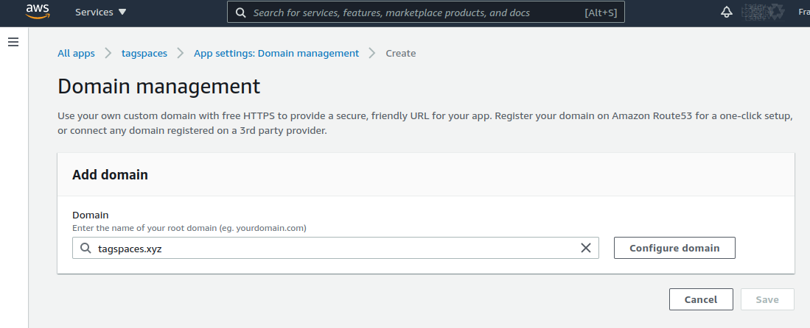
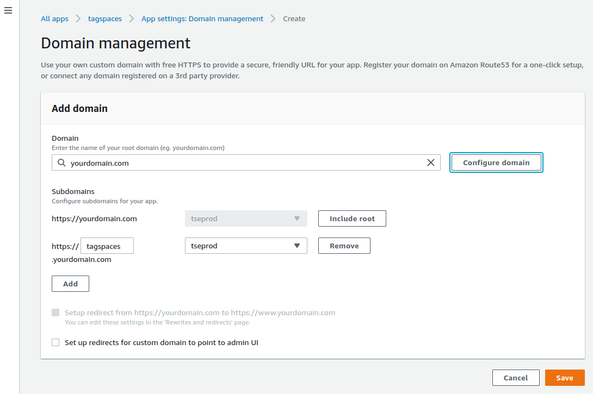
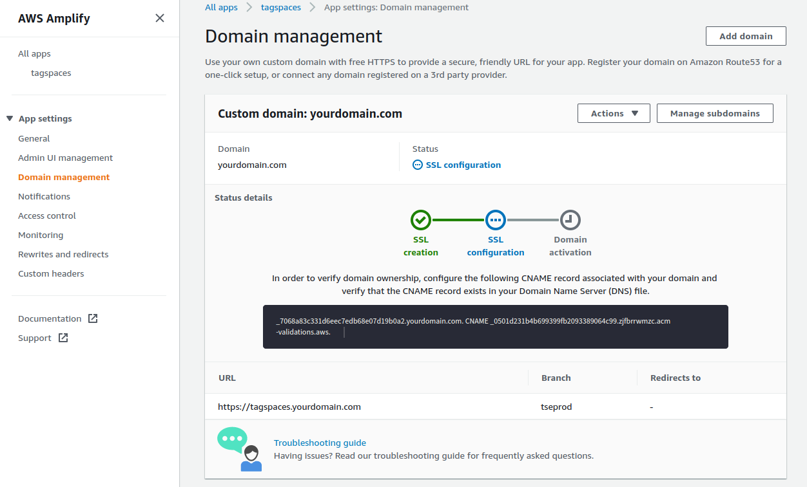

:::caution
⚒ This tutorial is work in progress
:::

## Introduction

Overview

<!--  -->

- User management - Cognito
- File hosting - S3
- Configuration data for the location and tag libraries - DynamoDB
- Access to DynamoDB - GraphQL

- Amplify, Cloudformation

## Initial setup of the amplify project

Before you start it's need to install amplify CLI:
`npm install -g @aws-amplify/cli`

Clone the tagspaces amplify repository
git clone https://github.com/tagspaces/tagspaces-amplify.git

GitHub username and access key will be provided by the TagSpaces team

1. Clone TagSpaces Repository `yarn ts-clone`.
2. Init amplify project in a cloud `amplify init`.
   - Environment name - this could be something like this: your-project-prod or your-company-name-dev
   - Group name - e.g.: project-name-group1, this is the id and the tenant used in the configuration of the dynamoDB bellow.
3. Publish it `yarn amppublish` - this will make `amplify push` create storage and functions && `amplify publish` Zipping artifacts and deploy it to the cloud.

Amplify cli will create user files S3 bucket and you can find the bucket name in generated tagspaces/app/aws-exports.js -> "aws_user_files_s3_bucket": "tsdatastorage165054-dev"
To create user to access your bucket created from amplify:
https://docs.tagspaces.org/tutorials/s3-bucket-locations#step-3---create-user-for-accessing-the-bucket

## Create IAM user for accessing the buckets

With custom policy allowing access only to the needed buckets

Don't forget to replace the bucket name in User Policy json.

## Configuring the default locations and tag library

Open [DynamoDB](https://eu-central-1.console.aws.amazon.com/dynamodb) and insert records in `Extconfig...` and `TagGroups...` tables.

Important entries in both tables are `id` and `tenant` (ts-demo in the following example), which is actually a Cognito group. Using the groups you can have separate configuration for different group of users. So users assigned in Cognito to a given group will see the locations and tag groups configured with the group name as id and tenant.

Create group


Assign group to user


Create entries in the dynamoDB tables:


### Locations

```json
{
   "id":"ts-demo",
   "tenant":"ts-demo",
   "createdAt":"2021-01-28T20:04:50.849Z",
   "IsFirstRun":false,
   "Locations": [
      {
         "name":"Your first AWS S3 location",
         "uuid":"uuid",
         "accessKeyId":"XXXXXXXXXXX",
         "secretAccessKey":"YYYYYYYYYYYYYYYYYY",
         "bucketName":"tsdatastorageXXXX-dev",
         "watchForChanges":false,
         "persistIndex":false,
         "fullTextIndex":false,
         "type":"1",
         "path":"",
         "isDefault":false,
         "isReadOnly":false,
         "region":"eu-central-1"
      },
      {
         "name":"Your second AWS S3 location",
         ...
      }
   ],
   "updatedAt":"2021-01-28T20:04:50.849Z"
}
```

Describe isNotEditable

###### Tag Library

```json
{
   "id":"ts-demo",
   "tenant":"ts-demo",
   "createdAt":"2021-01-28T20:04:50.849Z",
   "updatedAt":"2021-01-28T20:04:50.849Z",
   "replace":true,
   "tagGroups":[
      {
         "title":"Tag Group #1",
         "textcolor":"#ffffff",
         "color":"#008000",
         "uuid":"159a64bc-15ec-44d0-85ee-1215c157420d",
         "children":[
            {
               "textcolor":"#ffffff",
               "color":"#008000",
               "title":"tag1",
               "type":"plain"
            },
            {
               "textcolor":"#ffffff",
               "color":"#008000",
               "title":"tag2",
               "type":"plain"
            }
         ]
      },
      {
        "title":"Tag Group #1",
        ...
      }
   ]
}
```

:::tip
You can find the `group` which have been configured in the file `team-provider-info.json` located in the folder `./amplify/backend/`
:::

## Upgrading to a newer release of the TagSpaces Enterprise

To update execute `yarn ts-update`. In order to update the tagspaces-pro repository you should use the tagspaces-amp username and the provided personal access token.

```bash
TagSpacesDev:~/environment/tagspaces-amplify (eu-west-2) $ yarn ts-update
yarn run v1.22.10
$ cd tagspaces && git pull && cd extensions/tagspacespro && git pull && cd ../../..
Already up to date.
Username for 'https://github.com/tagspaces/tagspacespro': tagspaces-amp
Password for 'https://tagspaces-amp@github.com/tagspaces/tagspacespro':
....
Done in 10.71s.
```

Then you should execute `yarn amppublish` in order to deploy the changes in the amplify service. This command will call internally amplify publish, which will trigger the build of the TagSpaces Enterprise.

```bash
TagSpacesDev:~/environment/tagspaces-amplify (eu-west-2) $ yarn amppublish
yarn run v1.22.10
$ yarn update-graphql-schema && yarn graphql-codegen && amplify publish
$ amplify api gql-compile

GraphQL schema compiled successfully.

Edit your schema at /home/ec2-user/environment/tagspaces-amplify/amplify/backend/api/tagspaces/schema.graphql or place .graphql files in a directory at /home/ec2-user/environment/tagspaces-amplify/amplify/backend/api/tagspaces/schema
$ amplify codegen
✔ Generated GraphQL operations successfully and saved at tagspaces/app/graphql
✔ Code generated successfully and saved in file tagspaces/app/graphql/API.ts
✔ Successfully pulled backend environment dev from the cloud.

Current Environment: dev

| Category | Resource name                     | Operation | Provider plugin   |
| -------- | --------------------------------- | --------- | ----------------- |
| Auth     | tagspacesdf5c4ca5                 | No Change | awscloudformation |
| Hosting  | amplifyhosting                    | No Change | awscloudformation |
| Function | tagspacesdf5c4ca5PostConfirmation | No Change | awscloudformation |
| Function | tsTriggerFunction                 | No Change | awscloudformation |
| Function | tsSheduleFunction                 | No Change | awscloudformation |
| Api      | tagspaces                         | No Change | awscloudformation |
| Storage  | tsDataStorage                     | No Change | awscloudformation |

```

## Upgrading the version of the tagspaces-aws layer

The tagspaces-aws layer provides a lambda function for creating and updating the index used for the search and a separate lambda function for creating thumbnails from image files.

```
amplify function update
```



## Setup custom domain











## Further notes

On a Cloud9/EC2 setup, the regular build requires still `electron` which do not works OOTB, so the following command should be executed to install `chromium` package, which enables the electron package.

```
sudo amazon-linux-extras install epel -y
```

```
sudo yum install -y chromium
```

If you are using Cloud9 for the deployment of the TagSpaces Enterprise the minimal requirements for the EC2 instance is t3.small (2GB RAM 20 GB disk space).

In case of a JavaScript heap out of memory error, you can set the following environmental variable.
`export NODE_OPTIONS=--max_old_space_size=1024`
