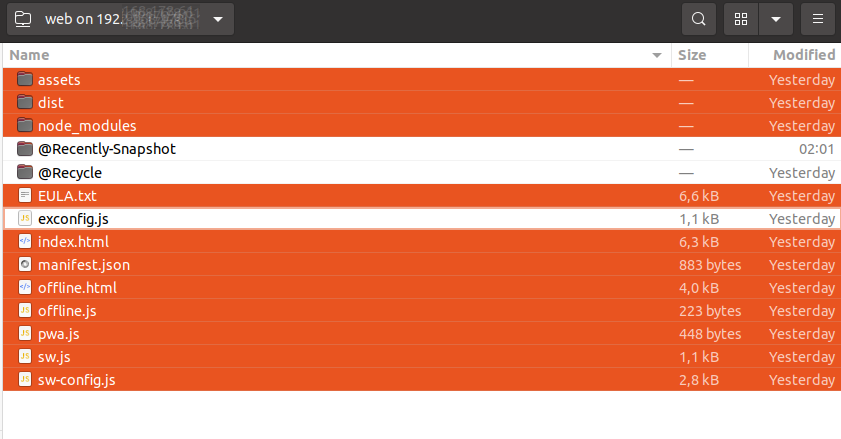

# Install TagSpaces Web on a Web Server

## Introduction

TagSpaces Web is a web based single page web application. For hosting it you need a web server able to host static content such as .html, .png, and .js files.

This tutorials explains you how to setup the "App Hosting" area located in the upper right part of the following deployment architecture diagram:


## Download and Unpack

The package can be downloaded from the link our [download page](https://www.tagspaces.org/downloads/). If you have purchased the PRO Web version, the download links are available in the email you have received from our payment provider after purchasing the product.

The downloaded package is a ZIP archive file which can be unpacked with this command:

```bash
$ unzip tagspaces-web-5.x.x.zip
```

The extracted files will be located in `./web` folder.

Change the ownership of all files in the web folder to your www user. In the following example the www user is called `www-user`, but this is not mandatory and on your system this user has probably another name.

```bash
$ chown -R www-user:www-user ./web
```

## Place the app in your web server

TagSpaces Pro Web can be installed on any modern web server offering static hosting of files like Apache or nginx.

Copy the content of `./web` to a folder which is hosted by your web server e.g. `./www`. So listing this folder should look something like this:

```bash
~/www $ ls -all
total 1476
    4096 Sep 17 10:29 .
    4096 Jan 15 20:42 ..
    4096 Sep 17 10:29 assets
    4096 Mär  6  2020 dist
    6038 Sep 17 10:29 index.html
   51519 Sep 17 10:29 logo.svg
    1004 Sep 17 10:29 manifest.json
    4096 Sep 24  2019 node_modules
    3859 Sep 17 10:29 offline.html
     452 Sep 17 10:29 pwa.js
    2066 Sep 17 10:29 sw-config.js
    1129 Sep 17 10:29 sw.js
 1305364 Sep 16  2019 third-party.txt
```

:::caution
Due to the current implementation, please make sure that you place the app files in the root folder of the web server. Using sub folders is currently not supported.
:::

## Securing the TagSpaces Web Installation

It is highly recommended to use HTTPS for connection to your TagSpaces installation, especially if your installation is available on the Internet. In order have HTTPS connection you will need to setup a valid ssl certificate. You can use such for free from provider such as [Letsencrypt](https://letsencrypt.org/). Setting up a SSL certificate is not in the scope of this article.

:::tip
**Use static hosting**: In order to reduce the attack vectors it is recommended to configure your web server to deliver only static content by disabling the support of PHP, Perl, ASP.Net, Java and other similar server side scripting language and frameworks
:::

## Setup Basic Access Authentication

On a Apache or nginx web servers you can setup very easily a **[basic access authentication](https://en.wikipedia.org/wiki/Basic_access_authentication)**, so not everybody knowing the URL of the installation can access the application. This is an optional step, which can be also exchanged with another way for securing the folder hosting the app.

### Create a .htaccess file

You can go to the folder which contains the TagSpaces web app and create a `.htaccess` file with this command:

```bash
$ touch .htaccess
```

This file should have the following content:

```
AuthType Basic
AuthName "Access to the staging site"
AuthUserFile /path/to/.htpasswd
Require valid-user
```

Replace in this file "/path/to/.htpasswd" with path on your system where you plan to place this file.

### Create a password file

In order to create file with user name and password pairs you will need the **htpasswd** command, which is part of **apache2-utils** (Debian, Ubuntu) or **httpd-tools** (RHEL, CentOS) packages. On Debian based Linux distributions you can install **apache2-utils** with the following commend:

```bash
$ sudo apt install apache2-utils
```

Create a password file with a initial user. Run the **htpasswd** utility with the **-c** flag (to create a new file), the file pathname as the first argument, and the username as the second argument:

```bash
$ sudo htpasswd -c /path/to/.htpasswd youruser
```

Press Enter and type the password for _youruser_ at the prompts.

Create optional additional user-password pairs. Omit the -c flag because the file already exists:

```bash
$ sudo htpasswd /path/to/.htpasswd yourseconduser
```

You can confirm that the file contains paired usernames and encrypted passwords:

```bash
$ cat /path/to/.htpasswd
youruser:$apr1$KkxMK/X2$AO2PMst7VdGgNCFKUTSit1
yourseconduser:$apr1$glNPbNg1$XvScMyvG6/TH6PX8jhoU.1
```

## Configure the web app

The TagSpaces web app can be configured with an external configuration file called **extconfig.js** located in the root path of the installation. With this file you can configure for example a custom logo and colors or you can deliver predefined locations and tag library to your users. A documentation of all supported options in this configuration file can be found [here](/dev/external-config).

:::tip
You can use the property [**ExtSaveLocationsInBrowser**](/dev/external-config#saving-locations-in-the-browser) in order to enable the persistence of the location's configuration in the local storage of the user's browser. This is especially useful if you for security reasons do not want to place location configuration (containing access and secret keys) in the extconfig.js. Once enabled the end-user can configure location in her browser and they will be available the next time she uses the app.
:::

This **extconfig.js** is not part of the installation so it have to be created manually. The specification of this configuration file is [here](/dev/external-config).

```bash
$ touch extconfig.js
```

After this command the installation folder should look like this:

```bash
~/www $ ls -all
total 1476
    4096 Sep 17 10:29 .
    4096 Jan 15 20:42 ..
    4096 Sep 17 10:29 assets
    4096 Mär  6  2020 dist
    6038 Sep 17 10:29 index.html
   34520 Sep 17 10:29 EULA.txt
   51519 Sep 17 10:29 logo.svg
    1004 Sep 17 10:29 manifest.json
     695 Sep 17 10:29 extconfig.js <----
    4096 Sep 24  2019 node_modules
    3859 Sep 17 10:29 offline.html
     452 Sep 17 10:29 pwa.js
    2066 Sep 17 10:29 sw-config.js
    1129 Sep 17 10:29 sw.js
 1305364 Sep 16  2019 third-party.txt
```

## Updating the web app installation

When a new version of the app is available, you just need to unzip the content and replace the files in the `www` folder of the web server. So if the this folder is mounted in you manager, you have to delete the files selected in the following screenshot and place the new files from the archive there.



:::caution
You should not delete `extconfig.js` if you using one for configuring TagSpaces. Be careful not to delete also special folders such as `Recently-Snapshot` or `@Recycle` if you are hosting the app on a NAS system.
:::

## Connecting your files to TagSpaces Web

After the setup of the web version, you will need to connect the so called locations containing the files you will manage with the application. The web version can currently connect only object storage (S3) locations, such as offered by Amazon AWS and Wasabi or hosted on you NAS with the help of MinIO. The following tutorials will help you with the setup.

- [Connect AWS S3 buckets as location](/tutorials/s3-bucket-locations)
- [Connect Wasabi buckets as location](/tutorials/wasabi-locations)
- [Expose local or server folder as object storage with S3proxy](/tutorials/folders-as-objectstorage-with-s3proxy)
- [Install MinIO and connect buckets from there as locations](/tutorials/setup-minio-bucket-nas)

<!-- ## Nginx again

You have to take care that not everyone can access your notes. We must now protect this directory with a password. Reopen your Nginx configuration file and add a location container for the TagSpaces directory. For me, this looks something like this:

    location /tagspaces {
            auth_basic "Secured Area";
            auth_basic_user_file /path_to/.htpasswd;
        }

As you can see, I use the same auth_basic variables as with the SabreDAV location. I use the same Credential File. Since these Credentials are already entered, its enough to save the changes to the Nginx Config and reload the Server: systemctl reload nginx

Now please close the browser Window so that the session ends locally. If you reopen the Browser with the URL of TagSpaces, the browser asks for the WebDAV Credentials. Enter the Credentials for WebDAV. Now you can access TagSpaces and add a new Location. In my case this is a subdirectory of the WebDAV Share. In my case sabredav/files/Notes. If you enter this Location, TagSpaces will nit ask again for Credentials since you have already established a corresponding session. From now on, you can manage your notes online via TagSpaces.

If you want, there are TagSpaces Clients for the Desktop or your Mobile Devices. Thanks to WebDAV Protocol, the files can be synchronized with any program. On Android, I use FolderSync, at Windows you can have the WebDAV share directly connected as a drive (there also exist special sync clients) and with Linux, a WebDAV Share can be seamlessly integrated into your directory structure. -->
