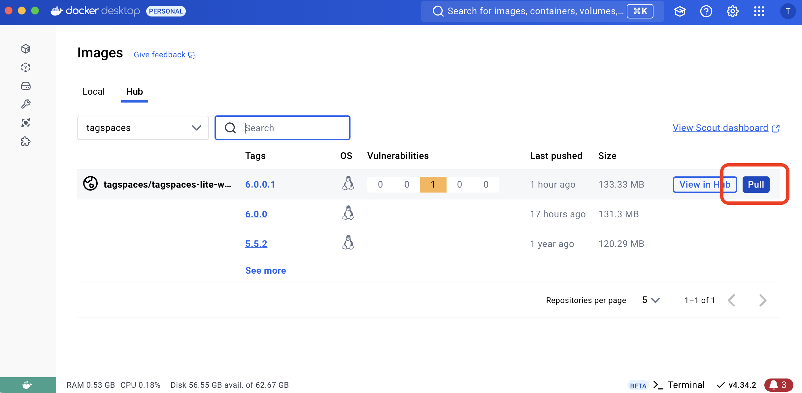
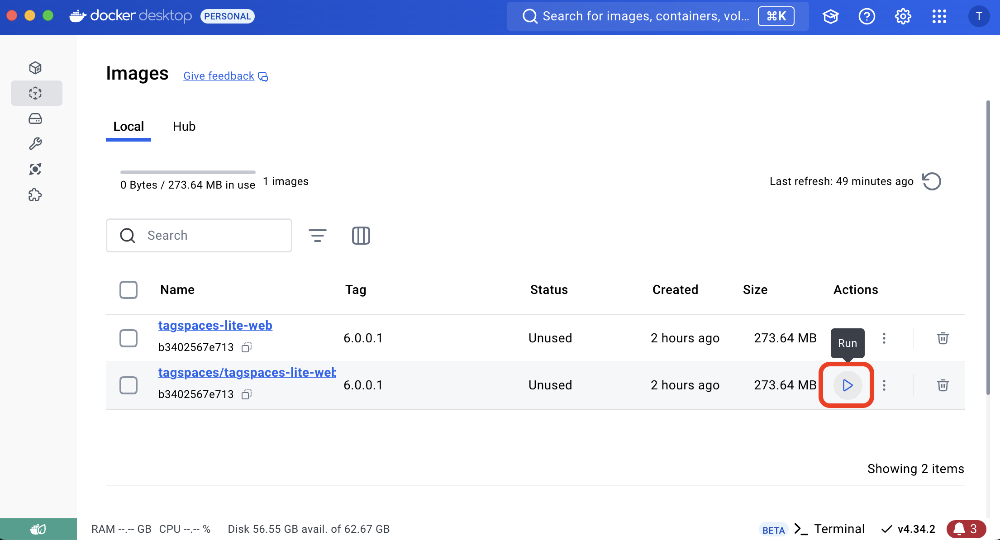
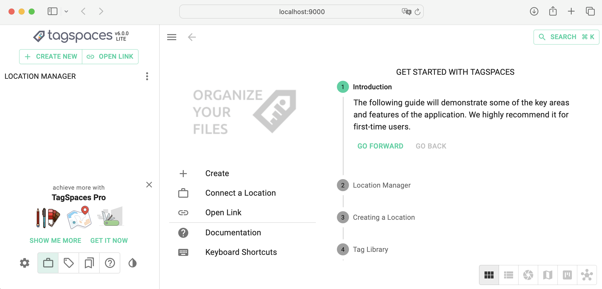
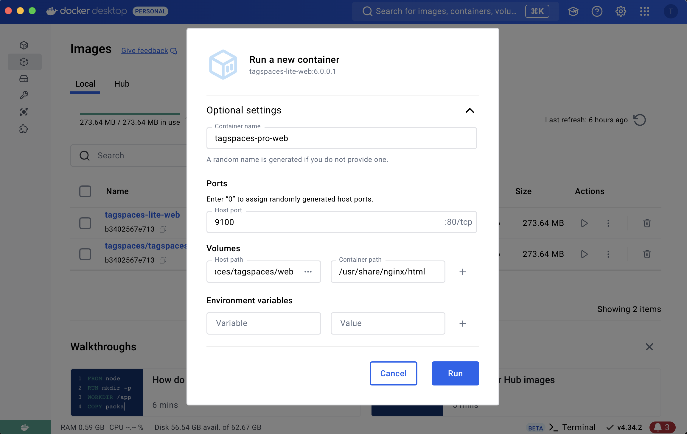
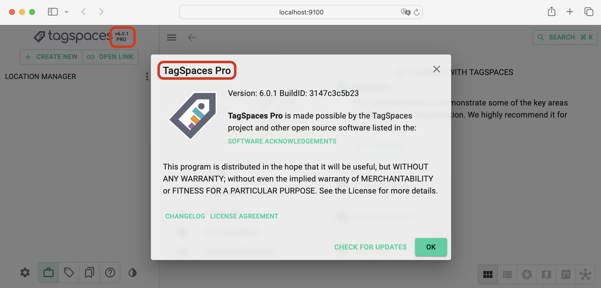
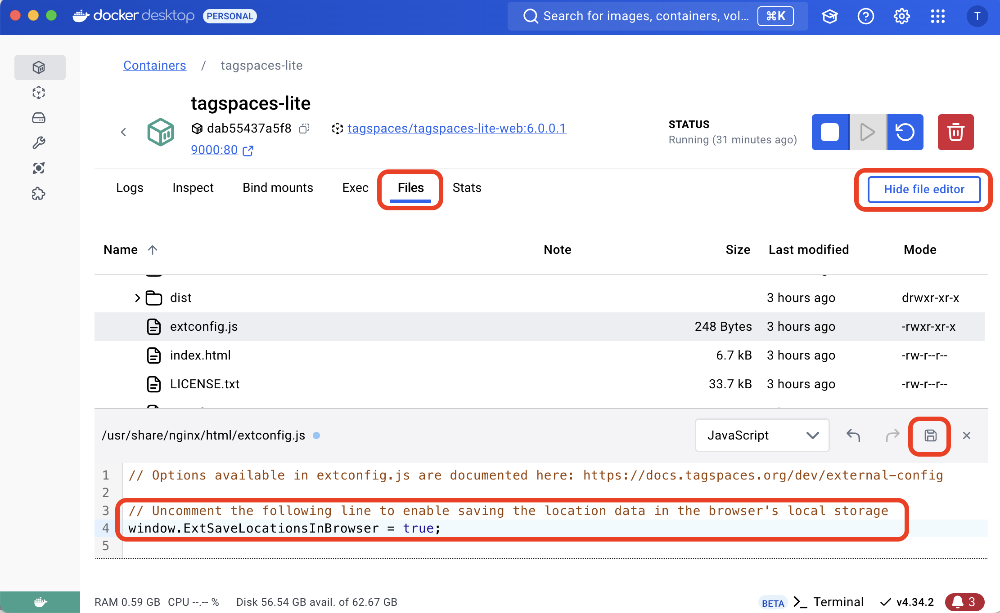
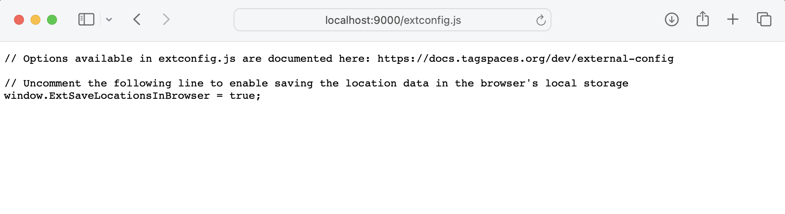
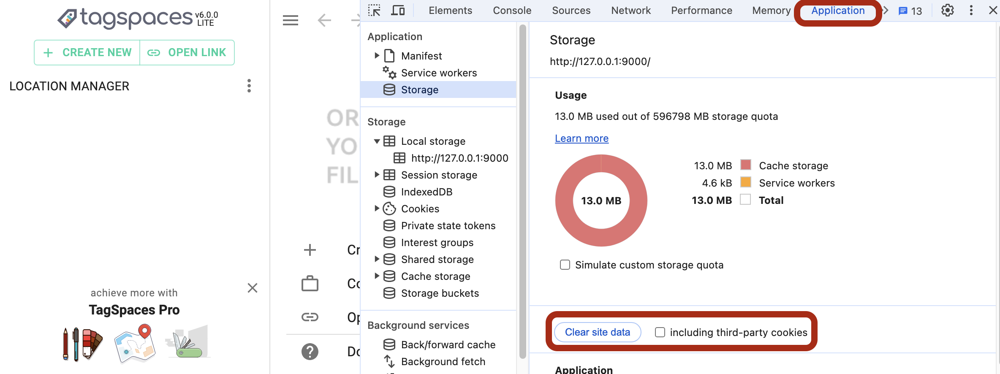
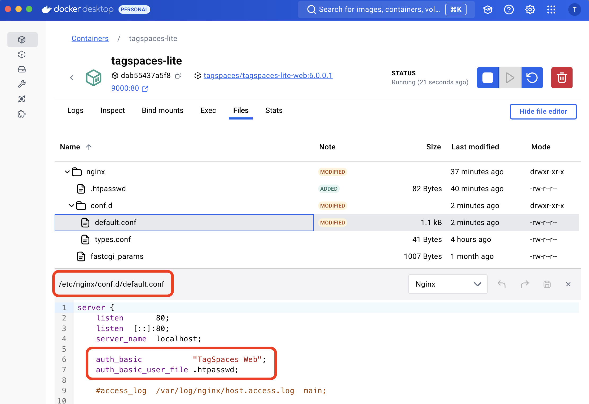
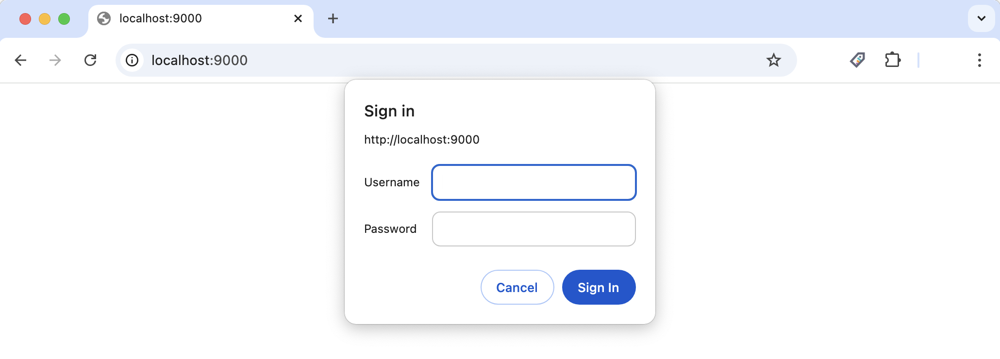

# Using TagSpaces with Docker

This guide provides instructions for using **TagSpaces Lite Web** and **TagSpaces Pro Web** as Docker containers. The Docker container is based on [Alpine Linux](https://www.alpinelinux.org/) and uses [nginx](https://nginx.org/en/docs/) as the web server.

## Get Docker {#getdocker}

Install Docker for your operating system from https://docs.docker.com/get-docker/.

## Using TagSpaces Lite Web with Docker {#tagspaces-lite-web-docker}

### Get the TagSpaces Lite Docker image {#tagspaces-image}

You can download the latest TagSpaces Docker image from [hub.docker.com](https://hub.docker.com/r/tagspaces/tagspaces-lite-web) or directly from the Docker Desktop app:



Click the `Pull` button to download the image locally.

Alternatively, you can use the following command in your terminal:

```bash
docker pull tagspaces/tagspaces-lite-web
```

### Run the image

Once the image is downloaded, you can run it in the Docker Desktop app:



These steps will create a TagSpaces container in your local Docker repository.

Alternatively, you can run the following command in your terminal:

```bash
docker run -dp 127.0.0.1:9000:80 tagspaces-lite-web:6.0.0
```

`9000` is the port on your local machine where the TagSpaces Web app will be accessible.

### Testing in the browser

If everything is set up correctly, open your browser and navigate to [http://localhost:9000](http://localhost:9000) or [http://127.0.0.1:9000](http://127.0.0.1:9000). You should see TagSpaces Web.



## Using TagSpaces Pro Web with Docker {#tagspaces-pro-web-docker}

### Download TagSpaces Pro Web package

Customers who have purchased TagSpaces Pro Web can download the package from the links provided in the purchase confirmation email.

### Unzip the package

Use your preferred tool to unzip the package. On macOS and Linux, you can run the following command in your terminal:

```bash
unzip tagspaces-web-pro.zip
```

This will create a folder called `web` in your current directory (e.g. `/Users/username/Downloads`).

### Creating the container

Get the _tagspaces-lite-web_ Docker image as described [here](#tagspaces-image).

Next, use the Docker Desktop app to create a new container from the tagspaces-lite-web image by clicking "Run" in the image area.


### Configuring the container

In the "Run a new container" dialog, open the optional settings and configure the following options:

- **Container name** - Something like "tagspaces-pro-web".
- **Port** - A different port than the one used for the Lite version.
- **Volumes**
  - **Host path** - The path where you unzipped the Pro Web package (e.g. `/Users/username/Downloads/web`).
  - **Container path** - Set to `/usr/share/nginx/html`.



### Testing in the browser

After running the container, open [localhost:9100](http://localhost:9100) in your browser. TagSpaces Pro Web should now be loaded.



## Enable location information to be stored in the browser

By default, TagSpaces Web does not store location information in the browser to avoid leaving sensitive data in external browsers.



If the file extconfig.js does not exist, rename `extconfig.tmpl.js` to `extconfig.js` in the container.

Reload the application in your browser and now on your location data will persisted in the local storage of your browser.

If everything went well you should see the extconfig under this URL: http://localhost:9000/extconfig.js in your browser.



### Clear local storage of the browser

:::warning
After enabling this feature, and save location data with access keys to s3 buckets in a browsers not used only by you (e.g. Internet Cafes, colleagues PC ...), please make sure to clean the local storage of the browser once you leave this browser, otherwise persons using the browser will get access to these buckets.
:::

Step to clear the local storage for the TagSpaces web app in the Chrome browser.

1. Open develop's mode (e.g. with the F12 key)
2. Navigate to tab _Application_
3. Click the _Clear site data_ button



In other browsers the steps are similar.

## Connect various S3 object storages as locations

Both versions of TagSpaces Web can connect to S3-compatible object storage. Here are some tutorials for connecting TagSpaces with popular services:

- [AWS S3](/tutorials/s3-bucket-locations) - Cloud service
- [Wasabi](/tutorials/tagspaces-web-wasabi) - Cloud service
- [S3Proxy](/tutorials/folders-as-objectstorage-with-s3proxy) - Self-hosted
- [Minio](/tutorials/setup-minio-bucket-nas) - Self-hosted
- Cloudflare R2 - Cloud service

## Adding basic authentication

To prevent unauthorized access, you can add basic authentication. Below are steps to configure this using the [Nginx documentation](https://docs.nginx.com/nginx/admin-guide/security-controls/configuring-http-basic-authentication/).

:::warning
Make sure the [extconfig.js](/dev/external-config) file is inaccessible to unauthorized users, especially if it contains access keys for S3 object storage.
:::

### Create a password file

Ensure `apache2-utils` (Debian/Ubuntu) or `httpd-tools` (RHEL/CentOS/Oracle Linux) is installed, then create a password file:

```bash
sudo htpasswd -c .htpasswd user1
```

Create additional user-password pairs. Omit the -c flag because the file already exists.

```bash
sudo htpasswd .htpasswd user2
```

### Copy the password file to the container

```bash
sudo docker cp .htpasswd tagspaces-lite:/etc/nginx/
```

### Modify the nginx configuration file

Add the following lines to the `server` section of the nginx configuration file in the Docker container:

```bash
auth_basic "TagSpaces Web";
auth_basic_user_file /etc/nginx/.htpasswd;
```

The configuration file is located at `/etc/nginx/conf.d/default.conf`.



### Restart the container

After saving the changes and restarting the container, an authentication dialog will appear in the browser. Log in with the credentials created earlier.



## Add custom TagSpaces configuration

TagSpaces can be partially configured using an external [configuration file](/dev/external-config) called `extconfig.js`, placed in the root folder of the application.

To add this file to the container, use the following command:

```bash
sudo docker cp ./extconfig.js tagspaces-lite:/usr/share/nginx/html/
```

The configuration file can include your locations or a custom tag library.

## Further Options

### Installing an SSL certificate from Let's Encrypt

SSL certificates are needed for both your TagSpaces installation and the object storage service (e.g., Minio, Zenko). A helpful tutorial for Ubuntu and Apache can be found [here](https://davidaugustat.com/web/set-up-lets-encrypt-on-intranet-website).

### Installing a self-signed SSL certificate

TBD

<!--
### Renewing the SSL certificate

TBD -->
