import { ProFeature, CenteredImage, CenteredVideo } from '@site/src/components/CommonBlocks';

One of the most common questions we receive about **TagSpaces** is whether it supports file synchronization between devices.  
Users often ask:

> “I’ve just tagged hundreds of files on my laptop — how do I see the same tags on my tablet or desktop?”

Our philosophy is that **TagSpaces doesn’t need its own sync feature**.  
Why? Because all metadata — including tags, colors, and descriptions — are stored **directly in the file names** or in accompanying **sidecar files** (located in the `.ts` folders).  
That means your tagging information _travels with your files_.

If you synchronize or share your files using existing tools, the tags go with them automatically.  
This design avoids vendor lock-in and ensures your tags remain portable, transparent, and under your control — even outside TagSpaces.

Most other tagging apps use an internal **database** for storing tags, which makes migration difficult and locks your metadata behind a proprietary format.  
In contrast, TagSpaces lets you retain ownership of your tagging data — forever.

## Using shared network folders

The simplest way to collaborate or use TagSpaces across multiple devices is to work from a **shared network folder** — for example, a file share on your LAN or NAS. You just have to connect the shared network folder or drive as location in TagSpaces.


<figcaption>Using TagSpaces with shared network folders</figcaption>

On Windows, you can mount a shared network folder as a drive with a specific letter using a command like this:

`mount \\ServerIP\ShareName Y:`

:::tip
This is the recommended method for connecting a network location in TagSpaces, as it provides a stable and consistent path. Alternatively, you can also use the direct UNC path (\\ServerIP\ShareName), which should work as well.
:::

✅ **Advantages**

- Easy to set up within a home or office network
- Multiple users can view and edit tagged files simultaneously
- All metadata (file names and sidecar files) remain consistent

⚠️ **Drawbacks**

- Usually not exposed to the internet without a VPN
- Not accessible from **TagSpaces Web** or mobile apps, since they work with **object storage** only

This setup works great for small local teams or households sharing a single network drive.

## Using cloud sync services

For most users, the easiest cross-device setup is to use a standard **cloud sync service** such as:

- [Dropbox](https://dropbox.com)
- [Google Drive](https://drive.google.com)
- [Microsoft OneDrive](https://onedrive.live.com)
- [Nextcloud](https://nextcloud.com)

These tools automatically synchronize files — and thus your TagSpaces tags — across all your devices (Windows, macOS, Linux).
You can even access the same files through **TagSpaces Web** if the service exposes S3-compatible access or if you use local sync clients.

```mermaid
flowchart
    subgraph Internet[Internet]
        direction TB
        subgraph PC1[Windows PC]
            direction RL
            TSLoc1["TagSpaces Location: Photos"]
            TSSync1["Synced Local Folder: Photos"]
            SyncSW1("Sync Software e.g. Dropbox Client")
            TSLoc1 <-->|connected| TSSync1
            TSSync1 <-->|connected| SyncSW1
        end
        subgraph CloudService[☁️ Cloud Storage Service e.g. Dropbox]
            direction BT
            SF1["Cloud Folder: Photos"]
        end
        subgraph MAC1[Mac Laptop]
            direction RL
            TSLoc3["TagSpaces Location: Photos"]
            TSSync3["Synced Local Folder: Photos"]
            SyncSW3("Sync Software e.g. Dropbox Client")
            TSLoc3 <-->|connected| TSSync3
            TSSync3 <-->|connected| SyncSW3
        end
        SyncSW3 <-->|sync| SF1
        SyncSW1 <-->|sync| SF1

    end
    style Internet fill:#e8e8e87d
```



<figcaption>Using TagSpaces with shared network folders</figcaption>

✅ **Advantages**

- Simple setup with desktop apps
- Real-time synchronization
- Reliable and well-supported

⚠️ **Drawbacks**

- Your data is stored on third-party cloud servers
- Limited control over privacy depending on provider

If you value convenience and cross-device consistency, this is the most seamless option.

## Using p2p sync services

If you prefer to stay cloud-free but still want automatic synchronization, try **peer-to-peer sync tools** such as:

- [Syncthing](https://syncthing.net/) – Open-source, private, and cross-platform.
  A great step-by-step guide for setting up TagSpaces with Syncthing can be found in this [Medium article](https://attilaorosz.medium.com/syncronise-your-offline-notes-across-all-devices-without-the-cloud-1e82fa53d1f1).
- [Resilio Sync (formerly BitTorrent Sync)](https://www.resilio.com/) – A proprietary but efficient peer-to-peer alternative.


<figcaption>Using TagSpaces with peer to peer synced folders</figcaption>

✅ **Advantages**

- Your files never leave your trusted devices
- End-to-end encrypted and decentralized
- Works great for local networks and private sharing setups

⚠️ **Drawbacks**

- Slightly more complex setup than cloud sync
- Not always ideal for users without always-on devices

This approach combines **privacy** with **convenient sync**, ideal for power users and privacy advocates.

## Using object storage on the internet

If you prefer a modern cloud architecture or want to use TagSpaces Web on mobile devices, consider using **S3-compatible object storage**.
TagSpaces Pro supports connecting such storage as locations. Common services include: [Amazon S3](https://aws.amazon.com/s3/), [Contabo Object Storage](https://contabo.com/) or [Cloudflare R2](https://www.cloudflare.com/r2/).

Each of these can be connected directly to TagSpaces through its “Object Storage” location type.
See our dedicated tutorials for setup details:

- [Using Cloudflare R2 with TagSpaces](/tutorials/cloudflare-r2-storage)
- [Using AWS S3 with TagSpaces](/tutorials/s3-bucket-locations/)
- [Using Contabo Object Storage with TagSpaces](/tutorials/contabo-storage)
- [Using Wasabi with TagSpaces](/tutorials/wasabi-locations)


<figcaption>Using TagSpaces with S3 services</figcaption>

✅ **Advantages**

- Accessible globally and ideal for remote collaboration
- Compatible with **TagSpaces Web** and **mobile**
- Scalable and backed by reliable infrastructure

⚠️ **Drawbacks**

- Typically involves some setup and credential management
- May incur cloud storage costs

## Using local object storage on your NAS

If you prefer self-hosting or need a private cloud, you can run your own **S3-compatible storage** locally on a NAS or server.

Popular self-hosted object storage options include:

- [MinIO](https://min.io/) – Lightweight and easy to deploy
- [S3Proxy](https://github.com/gaul/s3proxy) – Converts local filesystems into an S3 API
- [Garage](https://garagehq.deuxfleurs.fr/) – Distributed, open-source storage

These can all be connected as S3 locations in TagSpaces, just like cloud providers — but under your full control.

- [Using Garage with TagSpaces](/tutorials/garage-storage)

✅ **Advantages**

- 100% self-hosted and private
- Ideal for home servers or offices with NAS devices
- Full control over performance, backups, and security

⚠️ **Drawbacks**

- Requires some technical setup
- Remote access might need VPN or port forwarding

## Using locally synced object storage

If you want both **cloud storage** and **local file access**, tools like [Mountain Duck](https://mountainduck.io/) can sync S3-compatible storage as a **local folder**.

This means TagSpaces interacts with files locally, while Mountain Duck keeps them in sync with your cloud storage in the background.


✅ **Advantages**

- Full offline access and quick local performance
- Seamless integration with cloud backups
- Works with any S3-compatible service

⚠️ **Drawbacks**

- Requires a paid license for Mountain Duck (or similar tools)
- Slightly higher resource usage when syncing large datasets

This setup is perfect for users who want reliable backups, cloud redundancy, and fast local editing.

## Using encryption with Cryptomator

For **end-to-end encryption**, you can layer [Cryptomator](https://cryptomator.org/) on top of your chosen sync or storage setup.
Cryptomator creates an encrypted vault that can be opened locally, synced via cloud or peer-to-peer, and used directly with TagSpaces.

Check our detailed setup guide:
👉 [End-to-End Encryption with TagSpaces and Cryptomator](/tutorials/e2ee-with-tagspaces-and-cryptomator)

✅ **Advantages**

- Protects your data and tags with strong encryption
- Compatible with most cloud and object storage services

⚠️ **Drawbacks**

- Slightly slower file access due to encryption overhead

## Backing up your data

Whether you use local or cloud storage, regular **backups** are essential.
Open-source tools like [Plakar](https://plakar.io/) or [Restic](https://restic.net/) can automate backups to a variety of destinations:

- Cloud services (Dropbox, S3, R2, etc.)
- Network folders
- Local drives

:::tip
Always back up both your files _and_ the sidecar files (located in the `.ts` folders) — they contain TagSpaces-specific metadata.
:::

## Conclusion

TagSpaces gives you the freedom to organize and tag files **your way**, across all your devices and platforms.
Because your tags are stored with your files — not locked inside a database — you can freely choose your preferred sync, sharing, and storage strategy.

Whether you use Dropbox, Syncthing, your NAS, or a self-hosted S3 service, TagSpaces adapts to your workflow — empowering you to collaborate privately, flexibly, and without losing control of your data.

**TagSpaces: organize everywhere, own your data.**

```

```
