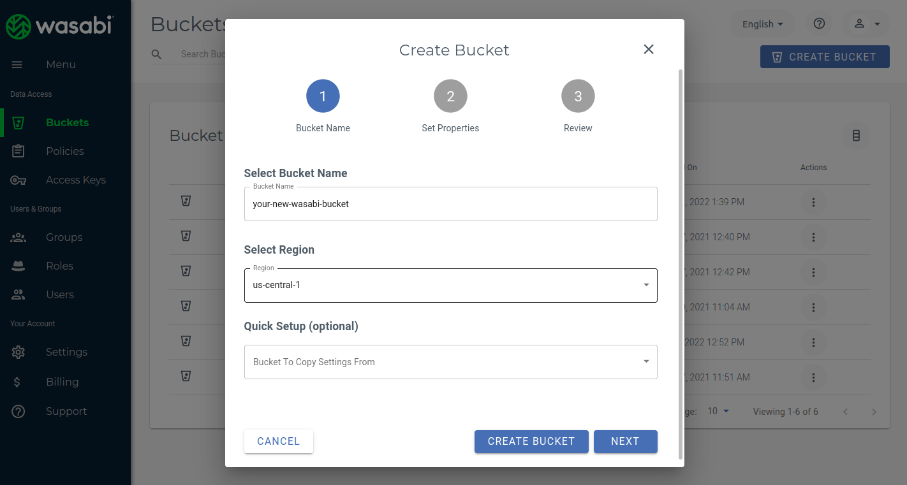
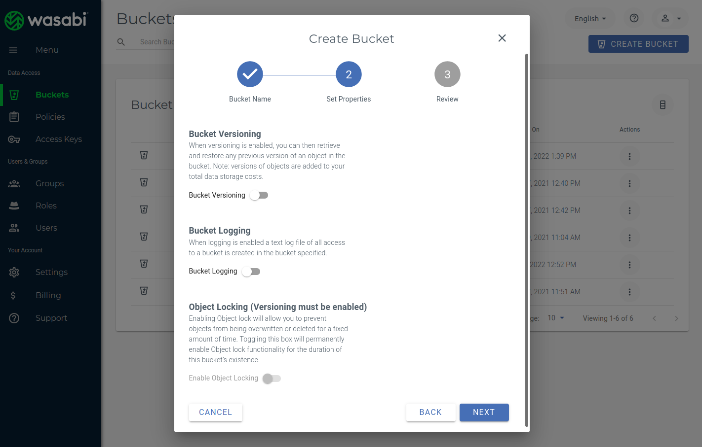
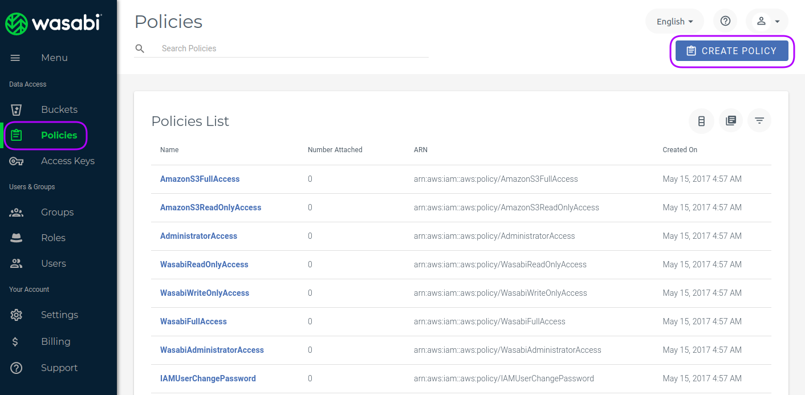
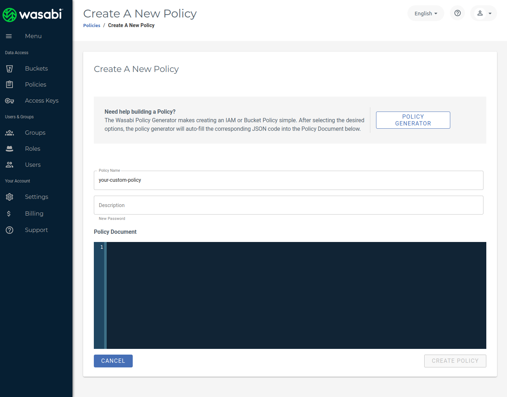
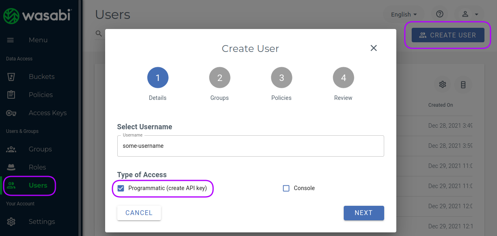
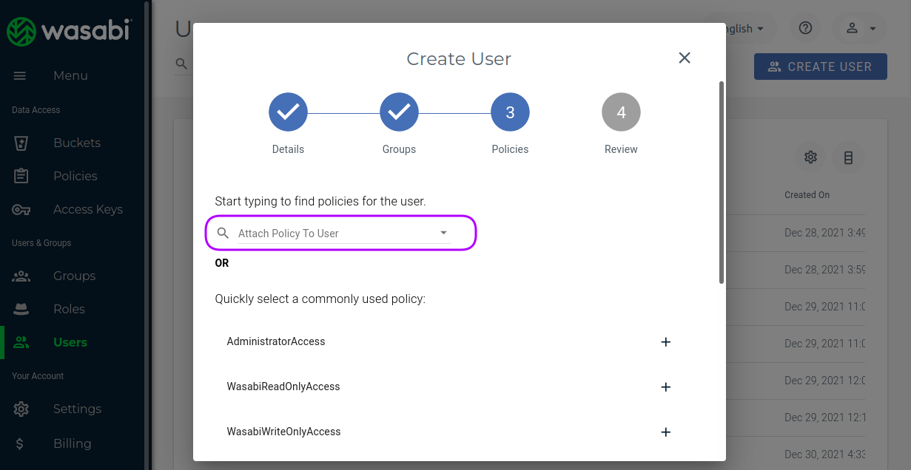
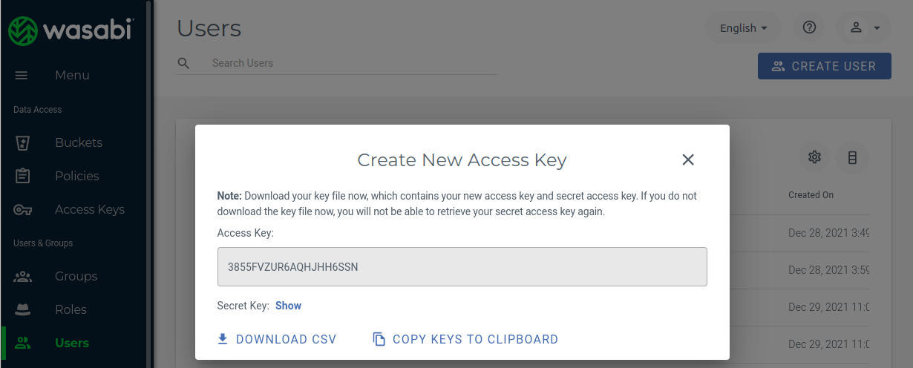
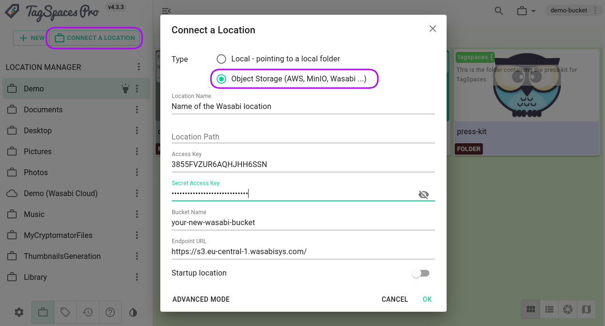

import { ProFeature, CenteredImage, CenteredVideo } from '@site/src/components/CommonBlocks';

<ProFeature />

TagSpaces Pro offers a way to connect S3 compatible object storage. Recently we figured out that this functionality works pretty well with the Wasabi cloud storage service and so I decided to write the following tutorial showing the steps needed to use TagSpaces with this service. [Wasabi](https://wasabi.com/cloud-storage-pricing/#three-info) is a affordable and reliable alternative to object storage offered by Amazon's AWS. By the time of writing the price is 5.99 $ per TB storage per month and they are not charging for download traffic(egress) or API calls. Which makes their offer in my opinion very attractive.

In order to follow this tutorial you will need a Wasabi account. Luckily they offer a 30 days [trial period](https://wasabi.com/sign-up/), so you can test the service for free.

## Creating a bucket

After creating the account and successful login, you need to create your first bucket. The buckets are places where you can store later your files. The creation is pretty easy, go to the bucket section and click on the "CREATE BUCKET" button. In the next screenshot you will see the bucket creation dialog, where you can define the bucket name (please don't use space there) and the region, which the physical location of the data center storing your files. I was pleased to see that since March 2022 there is the eu-central-2 region which located in Germany and GDPR compliant.



After clicking the "NEXT" button you will see the a page where you can enable some optional feature such logging or object locking.



When finish the bucket creation wizard the newly created bucket will appear in the bucket section.

## Create an access policy

Policies are needed to grand certain users or user groups access to the specific buckets. In order to create a policy you have to open the policy section and click on the "CREATE POLICY" button, visible in the next screenshot.



In the policy generation form which will appear you can give the policy a suitable name and description. Bellow you will find two policy templates in JSON format for read-only and for read-write access to the bucket. You can copy and paste them in the "Policy document" section visible in the following screenshot. You should adjust the bucket's name in the Resource section (highlighted) and optionally add or remove some actions.



:::tip
From a security perspective it makes sense to have a separate policy for every bucket you want to make accessible in TagSpaces or other external tools.
:::

### Read-write policy

The following policy gives you a full access on the bucket.

```json
{
  "Version": "2012-10-17",
  "Statement": [
    {
      "Sid": "VisualEditor0",
      "Effect": "Allow",
      "Action": [
        "s3:GetObjectAcl",
        "s3:GetObjectVersionAcl",
        "s3:DeleteObject",
        "s3:GetBucketWebsite",
        "s3:GetBucketNotification",
        "s3:GetReplicationConfiguration",
        "s3:ListMultipartUploadParts",
        "s3:PutObject",
        "s3:GetObject",
        "s3:RestoreObject",
        "s3:ListBucket",
        "s3:GetBucketPolicy",
        "s3:GetObjectVersionTorrent",
        "s3:AbortMultipartUpload",
        "s3:GetBucketRequestPayment",
        "s3:PutObjectAcl",
        "s3:ListBucketMultipartUploads",
        "s3:GetBucketVersioning",
        "s3:GetBucketAcl",
        "s3:GetObjectTorrent",
        "s3:GetBucketCORS",
        "s3:GetBucketLocation",
        "s3:GetObjectVersion"
      ],
      "Resource": [
        // highlight-next-line
        "arn:aws:s3:::your-new-wasabi-bucket",
        // highlight-next-line
        "arn:aws:s3:::your-new-wasabi-bucket/*"
      ]
    }
  ]
}
```

:::caution
The list of allowed actions in the previous JSON file is only a suggestion. The actions can be reduced, to just those which are really needed for your use case.
:::

### Read-only policy

Depending on your use-case you may want to access the bucket in a read-only mode

```json
{
  "Version": "2012-10-17",
  "Statement": [
    {
      "Sid": "VisualEditor0",
      "Effect": "Allow",
      "Action": ["s3:ListBucket", "s3:GetObject"],
      "Resource": [
        // highlight-next-line
        "arn:aws:s3:::your-new-wasabi-bucket",
        // highlight-next-line
        "arn:aws:s3:::your-new-wasabi-bucket/*"
      ]
    }
  ]
}
```

## Create a user

So now you may want to create some users which are going to have access to the bucket created previously.

In order to do this, you have to open the user's section in Wasabi console and click on the "CREATE USER" button shown in the next screenshot.



In the dialog which wll appear, you have to enter the user's name, click on the "Programmatic (create API key)" checkbox and press "NEXT". In the following section you can add the user to a group, which goes beyond the scope of this tutorial. So clicking one more time on the "NEXT" button will give you the ability to select the policy we have create in the previous section. This is very important step, since without a policy the user will have no rights on the bucket.



In the next section the API access key and the secret key will be automatically generated.



You can press the copy button in order to save the keys in for example the password manager of your choice.

## Connect the bucket as location in TagSpaces Pro

So now we are ready to connect the Wasabi bucket in TagSpaces Pro or TagSpaces Pro Web. You should choose the "Connect a location" button shown in the next screenshot and choose "Object Storage" as location type.



Now you will be able to enter additional parameters needed for the connection:

- **Location Name** - a free text for the name of the location in TagSpaces
- **Location Path** - optional parameter
- **Access Key** - generated in the user creation step of this tutorial
- **Secret Access Key** - generated in the user creation step
- **Bucket Nama** - as entered in the bucket creation step of this tutorial
- **Endpoint URL** - for example https://s3.eu-central-1.wasabisys.com/ for the eu-central-1 region of Wasabi, as select in the bucket creation step

Once you confirm the dialog, TagSpaces will try to connect to the bucket and show the files and folders in the bucket.

## Conclusion

In this tutorial we learned how using **TagSpaces Pro** in combination with object storage service providers such as **Wasabi** will allows you to easily create and manage you own scalable Dropbox like application.
