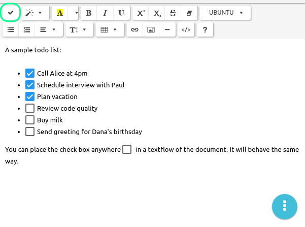

# Taking notes with TagSpaces

TagSpaces has the ability to create and edit new files in [plain text](/extensions/editorText.html), [HTML](/extensions/editorHTML.html) and [markdown](/extensions/viewerMD.html). With these functions the application can be used as valuable alternative to note taking and personal wiki systems such as Evernote, Onenote, TidyWiki and others.

## TODO Managemnt

### <a id="todosrichtexteditor" href="#todosrichtexteditor">Support for ToDo / checkboxes in the rich text editor</a>
One long awaited feature for the application is to support managing of todo lists. This is a core feature in concurrent products such as Evernote or Onenote and finally we manage to integrate in the HTML editor extension, so now it is available to all TagSpaces users on all platforms.

The functionality is very simple, yer powerful. You can place a checkbox by placing the text cursor somewhere in the document and then click on the checkbox button (in the upper left corner of the previous screenshot). This way you can make any text element a todo item. Which can be then organized in lists or in other ways. Once you completed a given task, you can click on its ckeckbox in order make your achievement visible. The todo checkbox can be clicked only when the file is in edit mode.

> Tip:
> [Exporting Evernote notes](https://www.tagspaces.org/blog/export-your-evernote-as-local-files/)
