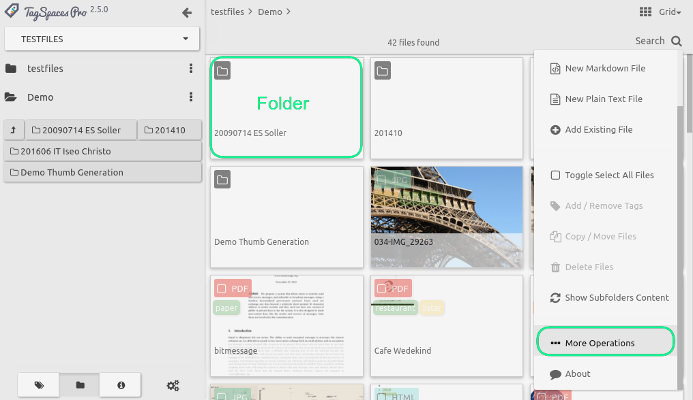

# Browsing File and Folder Structures

tbd

## Working with the List perspective

### Showing folders in the grid perspective
This new feature gives shows in folders in the perspectives in addition for files. It enables a more intuitive way for navigating through folders, which is common the file managers build in the most modern operating systems. We implemented it as a pilot in the grid perspective, but the feature is not enabled by the default. It can be activated from the *More Operations* dialog of the extension. This dialog can be opened from a menu item with the same name located in the extensions main menu (the yellow button in the right bottom corner). See the screenshot bellow for details. We plan to integrate it also in the list perspective.

## Working with the Grid perspective
tbd

## Working with the ImageSwiper perspective
tbd