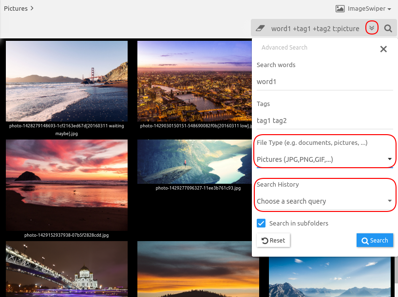

# Searching for files and folders

TagSpaces has an integrated file and folder search functionality. The difference to the classic Desktop Search software is that the search is performed only in the currently opened location or folder. The search is based on a **index**, which is created immediately after the user opens a given location and has the following functionality:

* The search query in the free version consists of two components. The first one is just a simple free text which searched in the index. The second component is a list of tags. At least one of the tags should be assigned to a given file or folder in order to be included in the search results.
* The search algorithm considers with different weight the following fields from the index.
  - The file or folder name
  - The tags assigned to the file or folder
  - The description added to the file or the folder
  - The file or folder path
  - The content of txt, md and html, if the full text search is activated for the current location (TagSpaces PRO only)
* The search algorithm has a build-in fuzziness, meaning that if the free text search query contains a misspelled word, TagSpaces will try to find files and folder with the best ques.
* The tag search is strict, without fuzziness, if you are not sure about the exact name of a tag, write in the free text query.
* The search is case insensitive.
* The user can switch to the search area by clicking the Ctrl+3 / Cmd+3 key combination (configurable in the Setting).

## Basic search
In order to provide a boolean search support for tags, the search user interface for tags was split in three input fields:
* Must contain all of the tags - all of the tags listed here should be attached to the files or directories (**logical AND search**)
* At least one tag - any file or folder which contains one of the specified here tags will be included (**logical OR search**)
* None of these tags - entries which have one the tags listed here will be excluded from the search results (**negative search**)

<figure>
  
  <figcaption>Short video showing searching for tags in action</figcaption>
</figure>

> **Note:** After opening of a certain location, the application starts to index in background all the files and folders from this location recursively. During the indexing time the search is not available to the user, but all other functionalities are accessible. Opening of location containing more the 100000 files could lead to performance issues, during the index or later by search.

### <i class="profeature">pro</i>Advanced search

In addition to the searching by files name and by tag, the search in the PRO versions supports the following features on top:

#### <i class="profeature">pro</i>Search by type

In the file type dropdown you can specify types of the files you want to search. The following groups are supported:

* Pictures and Photos: JPG, PNG, GIF, etc.
* Documents: PDF, ODF, DOCX, EXL, etc.
* Notes: MD, TXT, HTML, etc.
* Audio files: OGG, MP3, WAV, etc.
* Video files: WEBM, OGV, MP4, etc.
* Archives: ZIP, RAR, TGZ, 7Z, etc.
* Bookmarks: URL, LNK, etc.
* eBook EPUB, MOBI, AZW, PRC, etc.

In addition to that we offer some special filters:
* Folders - showing only folder
* Files - showing only files
* Untagged files or folders - showing only files and folders witch are not tagged

<figure>
  
  <figcaption>Screenshot of the advanced search options</figcaption>
</figure>

#### <i class="profeature">pro</i>Search by file size

#### <i class="profeature">pro</i>Search by last modified date

#### <i class="profeature">pro</i>Search by time period

#### <i class="profeature">pro</i>Search by GPS coordinates

<!-- ## Search based on filenames

TagSpaces has a build in file search functionality. The difference to the classic Desktop Search software is the search is performed only in the currently opened location, since we for now do not index the files. The search has currently the following features:

* On the majority of file types the search considers only the file name for the search result. On some text based files such as txt, markdown or html the text content is also analysed, but this is still an experimental feature.
* It searches your sub-folders recursively by default. This could lead to performance issues on folders with many files and sub-folders. If you want the search to ignore the sub-folders, add `~` character in front of your search query. The default search in the sub-folders can be disabled in the settings. Example: If you want the find files having the word `word1` located in current folder, ignoring the sub-folders you have to enter `~ word1` in the search input box.
* If you want to find all files tagged with a certain tag, you can add the `+` character in front of the tag name. This way occurrences of this word somewhere else in the file name or content will be ignored. Example: If you want to find all files from the current folder tagged with the tag `tag1` you have to enter `+tag1` in the search input box.
* The name of the parent directory of a given file is also considered by the search algorithm. So for example if you are searching for photos from you vacation in USA and the folder where these files are located contains the word USA (e.g. '20160301 vacation usa 70D'), then the search will list all the files located directly in this folder.

Feature versions of the application could include a file indexing functionality for a faster and responsive search.

## Limit search results

We have added an options in the settings to limit the maximal search results or files to be shown in the current perspective. With this version of TagSpaces we changed the default behaviour of the search and now the applications searches automatically in the subfolder of the current folder recursively. This of course may lead on big directory tree to performances issues. That's why have build in a switch in the options where you can disable this functionality.

## Advanced search

TagSpaces PRO search is very powerful. It offers users the opportunity to discover easier and faster the right result for them.

One of the advantages of TagSpaces PRO's search are search operators. They are words that can be added to searches to help narrow down the results. You can use all of the search operators directly in the search box, without opening the advanced search dialog. Here is an example:

/media/search-syntax-example.png

So for the example above the search query **t:picture sport** will give you all pictures containing the word **sport**. No matter where it is located search operator in the search query and will work both placed before the search word or after.

Another way is to click on search button () to showing the search field and then click on pointing down arrow () to open the advanced search dialog. Fill the keyword in **Search Words** and the file type in **File Type** and will achieve the same effect as above way.

Please make sure, that when you are using search operators, there is no any spaces between the operator and your search terms. A search for **t:picture** *sport* will work, but **t:** **picture** *sport* won't.

| Operator | Operator |
| -- | -- |
| t:picture | Search only for pictures with the following extensions for example: *JPG*, *JPEG*, *PNG* and etc. Short search example: **t:picture photo** |
| t:doc | Search only for documents with the following extensions for example: *DOCX*, *PDF*, *ODF* and etc. Short search example: **t:doc document** |
| t:note | Search only for notes with the following extensions for example: *MD*, *TXT*, *HTML* and etc. Short search example: **t:note note** |
| t:audio | Search only for audio with the following extensions for example: *OGG*, *MP3*, *WAV* and etc. Short search example: **t:audio song** |
| t:video | Search only for video with the following extensions for example: *WEBM*, *OGV*, *MP4* and etc. Short search example: **t:video clip** |
| t:archive | Search only for archives with the following extensions for example: *ZIP*, *RAR*, *7Z* and etc. Short search example: **t:archive arch** |

If you need more information about supported file types, please take a look at [this article](https://www.tagspaces.org/supported-file-formats/).

### <i class="profeature">pro</i>Advanced search

The advanced search dialog in TagSpaces PRO contains two more search features:

### <i class="profeature">pro</i>Search by file type

In the file type dropdown you can specify a group of files you want to search. The following file type groups are supported:

* Pictures: JPG,PNG,GIF,... (query shortcut t:picture)
* Documents: PDF,ODF,DOCX,EXL,... (query shortcut t:doc)
* Notes: MD,TXT,HTML,... (query shortcut t:note)
* Audio: OGG,MP3,WAV,... (query shortcut t:audio)
* Video files (WEBM,OGV,MP4,... (query shortcut t:video)
* Archives (ZIP,RAR,TGZ,7Z,... (query shortcut t:archive)

> **Note** You can use the query shortcut for a given file type directly in the search box, without opening the advanced search dialog. So for example the search query `t:audio coldplay` will give you all audio files containing the word coldplay.

### <i class="profeature">pro</i>Search history

For quick access TagSpaces PRO keeps a history of your last 15 search queries in a list. This list can be cleaned by selecting the last item in it called "Clear search history" in it.

## <i class="profeature">pro</i>Text extraction and full text search &nbsp;ALPHA{#fullTextSearch}

After activating the text extraction checkbox in the settings, TagSpaces PRO will try to extract the text content of files you are currently browsing. This text content is saved in the hidden `.ts` folder and is considered later by the search. Since this is a early experimental feature, please don't relay only on ly on it.

These file formats are currently supported:

* Notes: HTML, MD, TXT (extracts the text content)
* Office Documents: PDF, ODT, ODP, ODS, DOCX, XLSX, PPTX (extracts the text content)
* Images: JPG (extracts Exif and IPTC informations)
* Audios formats: MP3 (extracts id3 tags)
* Ebooks: EPUB (extracts the text content)

-->