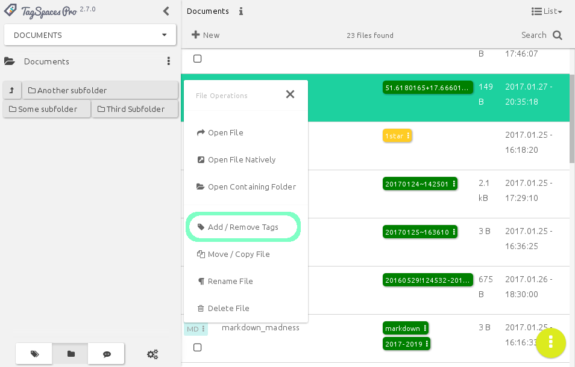
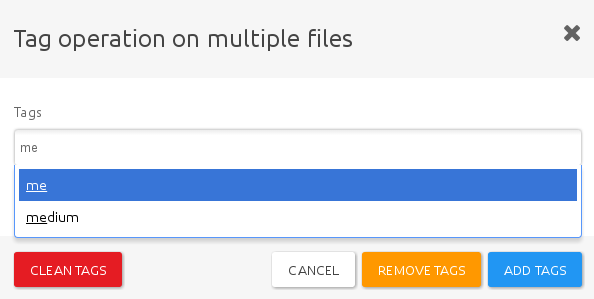
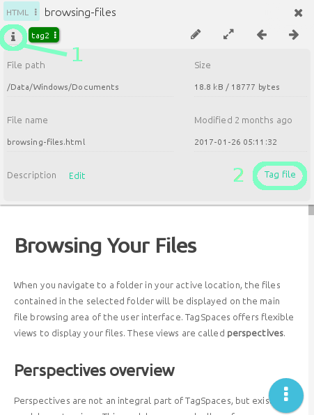
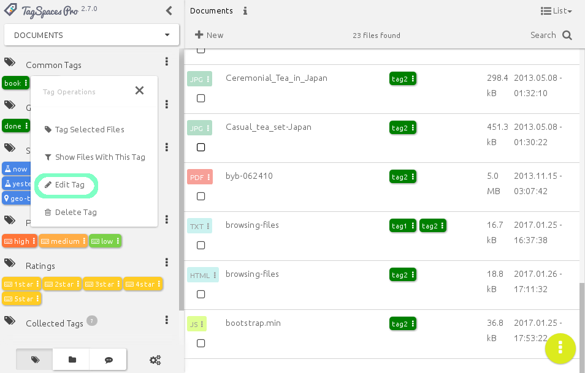
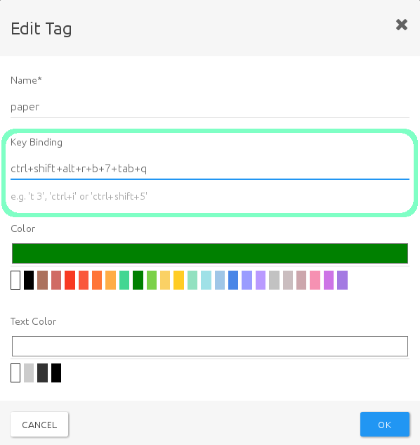
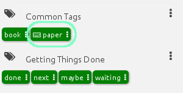
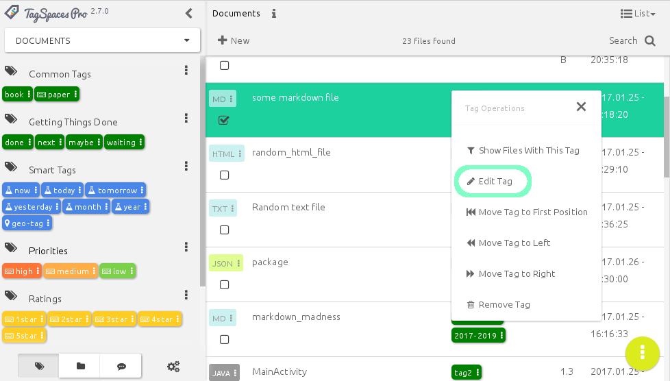
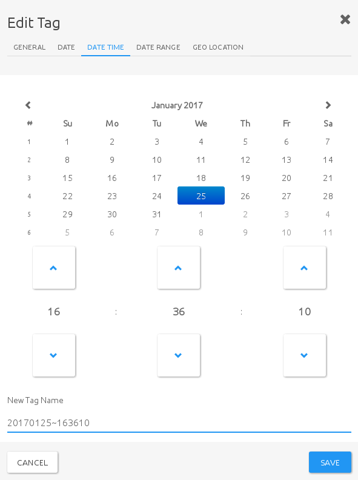

# Organize your data with tags

<!-- toc -->

## Motivation
Tagging and tags are a fresh approach to categorizing and grouping things. Tagging allows the user to label thing with their own words. They don’t need to conform to keywords or categories created by somebody else. Tagging allows you to describe what you’re seeing in your own words, to imbue the experience with your own meaning. Tagging saves your time, and can makes searching for a specific song, movie, book, document, note, or whatever you’re looking for, much easier and faster.

Tags are personal things. Tagging something is your emotional response and not simply a taxonomic decision. With using tags, you have the control to define things for yourself, and on the web -- not only for music, literature, games and movies, but also public websites, data repositories and consultations. Tagging is a new indirect way of control to express your mind and to name things your way -- you can call it a form of "freedom of speech", if you want to go that far. Tagging is a power to create your own genres in movies, music popular culture, or basically anywhere.

## File Tagging based on filename

TagSpaces supports tagging of files in a platform agnostic way. It uses the name of the file to save this kind of meta information. As an example if you want to add the tags `vacation` and `alps` to a image named `IMG-2653.jpg`, TagSpaces will simply rename it to `IMG-2653[vacation alps].jpg`. File renaming is of course a rather controversial decision (see our users [discussion](https://tagspaces.uservoice.com/forums/213931-general/suggestions/7176956-don-t-reinvent-the-wheel-use-metadata-systems-tha)), which has its own limitations (e.g. on some operating systems the file path length is limited to ca. 256 characters), but it allows a portable way for adding tags on every platform, be it offline, online, or even cloud based.

## Timestamp as default tag

When you create a new file in TagSpaces, a time-stamp in the format of YYYMMDD~hhmmss will be automatically added as a tag, where

* `YYYY` means the current year
* `MM` - the current month
* `DD` - the day
* `hh` - the hour
* `mm` - the minute
* `ss` - the second

when the file was created. For example a file created on the 17th of January in 2017, at 10:30 (and 32 seconds) would be tagged with timestamp like `20170117-133032`

Such timestamps make it possible to easily group files from different locations based on the time of creation. Of course this would be possible by reading the same information from the file system, but tagging with the timestamp allows for greater flexibility. For example you can change the timestamp to anything you like, while keeping the original creation modification date of the file, and tagging the file will allow you to use TagSpaces's powerful grouping and organizing features in the same place you manage other tags.

## Tagging with Drag and Drop

The user interface was designed for touch screens, but it also supports drag & drop operation for the desktop, such as:

* Adding tags from the tag groups to files in the List and Grid perspectives and to the file viewer
* Moving tags from one tag group to another

<video src="/media/tagspaces-drag-drop.mp4" autoplay="true" loop="true" poster="/media/tagspaces-drag-drop.png" class="img-responsive"></video>

## Tagging using context menus

A context menu can be accessed by either clicking on the file extension icon of a single file (in List Perspective), or by right clicking a file or a selection of multiple files. From the context menu, select *Add/Remove Tags*

to access a popup dialog, that allows you to manage tags on the file. This popup dialog will not display the currently active tags, but allows you to specify tags by name, offering suggestions based on tags currently in the tag library.

The options you have here are:

* **Clean  tags**, which will remove all tag information form the selected files
* **Remove tags** will remove the specified tags from the files
* **Add tags** will add the specified tags to the selected files

The popup dialogue can also be accessed from the file preview area, by clicking the file info icon (**1**), and selecting *Tag File* (**2**)

<!-- ## Tagging using keyboard shortcuts
Another quick way to tag files is to set keyboard shortcuts to often-used tags. To specify a shortcut, click on a tag in the **Tag Library**, and select *Edit Tag* from the context menu

You will then be presented with the **Edit tag** popup dialogue, in which you can specify the keyboard shortcut under **Key Binding**

Tag that has a keyboard shortcut assigned, are marked with a little keyboard icon in the tag library

Shortcuts can be single characters, key combinations, or sequences of two or more characters.
* To specify a single key shortcut, type that key into the box. E.g. to set the key `a` as a shortcut for a tag, simply type the letter 'a' and press OK.
* For key combinations, type all keys separated by a plus sign (`+`). E.g. to specify `Ctrl+Shift+a` (to be pressed simultaneously) as a shortcut, just type "ctrl+shift+a".
    > **Note:** For combinations to work, you do not need to use modifier keys. `a+g+6` is as valid a combination as would e.g. `ctrl+shift+6` be
* To use character sequences, type each character, separated by a single whitespace. for example, when you set `a b c` as a shortcut, you would need to type the letters 'a', 'b' and 'c' after one another to tag a file. You do not need to do this quickly, as long as you do not press anything else, the sequence will be recognised. This feature can be quite useful for users, who experience difficulties pressing certain key combinations.
    >**Note:** Modifier keys, such as `Ctrl`, `Shift`, etc, **can** be used in sequential combinations. Specifying e.g. `ctrl a` would make a shortcut of pressing `Ctrl` followed by `a`. pressing the keys simultaneously would not work in this case.

Using keyboard shortcuts can also work on multiple files. If you select more than one file, the tag bound to the key(s) or key combination you press will be applied to all of them.

>**Note:** Keyboard shortcuts can **not** be used to remove tags, only to assign them. -->

## Smart tags

Smart tags are one of the advanced tagging features of TagSpaces. Smart tags can be either **date and time**, or **location based**, and offer convenient **dynamic tagging** tagging, based on a range of criteria.

### Date and time based smart tags

These smart tags offer a quick and easy way to timestamp documents or files, with different levels of precision. Dragging or applying a smart tag to a file will create a tag based on the current time date. Currently the following tags and formats are available:

* **now** - This tag will create a very precise timestamp (from current year, down to seconds) of the moment you have applied it, in a format of `YYYMMDD~HHmmss`, e.g. `20170314~145021`
* **today**, **tomorrow and **yesterday** will apply a timestamp with the current, the next, or the previous day's date,  in the format of `YYYYMMDD`, e.g. `20170314`.
* **month** will create a timestamp of the current month, in the format of `YYYYMM`, e.g. `201703`
* **year** only applies the current year, in the format of `YYYY`, e.g. `2017`

> **Note:** Every newly created file will automatically have a smart tag, equivalent to **now**.

Smart tags, once applied, can be edited, or further refined be refined to include date ranges. Clicking on a tag, ans selecting *Edit Tag* form the context menu

will bring up a popup dialogue also called **Edit Tag**

besides being able to easily modify date, or date/time tags on their respective tabs, you can also specify date ranges in the following formats:

* **Year Ranges:** 2016-2018
* **Month Ranges:** 201605-201701
* **Date Ranges:** 20160531-20160603
* **DateTime Ranges**: 20160529~124532-20160529~154500

### <i class="profeature">pro</i> Geo tags

The geo tag is a special kind of smart tag, available in TaSpaces **PRO**, that allows tagging files with precise geolocation coordinates. When You drag the tag "geo" on a file, the **Edit tag** popup window with the Geo Location tab will open, showing a map from OpenStreetmap. You can drop a pin anywhere, and move it around, it automatically becomes a tag in the format of `latitude+longitude`, e.g. `47.2792290+18.9843750` This tag will then be applied to the file and treated as a geo-smarttag by TagSpaces

## Priorities and ratings

These special tags are useful for organising files by either importance or quality. You can apply priorities `high`, `medium` and `low`, and start ratings from `1start` to `5star`. Star ratings are yellow by default, whereas priorities are colour coded to easily distinguish visually.

<!-- Priority and star ratings all have predefined keyboard bindings assigned to then, to that using them becomes really straightforward and fast. Currently the following key-bindings apply:

### Priorities:
* **high** - `t h`
* **medium** - `t m`
* **low** - `t l`

### Start ratings
* **1star** - `t 1`
* **2star** - `t 2`
* **3star** - `t 3`
* **4star** - `t 4`
* **5star** - `t 5` -->

Users can easily extend these tags: You can simply create a new tag and add it to e.g. the priority group, give it a name a colour and a key binding, and you are all set.

## <i class="profeature">pro</i>File Tagging based on sidecar files {#file-tagging-based-on-sidecar-files}

As alternative to saving the tagging information in the file names, TagSpaces PRO offers saving this kind of meta information in a sidecar files located in a hidden `.ts` folder. This option can be activated in the settings of the application as shown in the following screenshot.

> **Note** Please note that by default the `.ts` folder is hidden only on OSX and Linux operating systems, on Windows folders the preceding dot in front of the filename will not mark the file as hidden by default. Setting these folders as hidden on Windows can be achieved manually or with custom script if needed.

After the activation, the application will create an extra file for every tagged file, having the same file name as the source file but with the additional JSON extension. For example after tagging some files in some of your file locations you will have a similar file structure.

    ~ location (with your files)
    ├── subfolder
    │   ├── .ts
    │   │   ├── file1.jpg.json
    │   │   └── file2.pdf.json
    │   ├── file1.jpg
    │   └── file2.pdf
    ├── .ts
    │   ├── file3.png.json
    │   └── file4.docx.json
    ├── file3.png
    └── file4.docx

The main advantage of this solution is that the name of the files is not altered by tagging and there is theoretically no limit to the amount of tags you can add to a given file. However this approach might also has its own drawbacks: If you move or rename tagged files in TagSpaces it will take care of the sidecar file, which will also be renamed or moved in the appropriate folder. But if you move, rename, or delete a file in an external applicaiton, you have to move, rename, or delete the matching sidecar file in the `.ts` folder manually.

>**Hint** If you want to have the files located in the `.ts` folder synched with some cloud service such as Dropbox or Google Drive, you will have to enable the synching of hidden folders and files.

## Folder Tagging {#folder-tagging}

It is possibly to apply tags to folders. Folders can be tagged in the same way as files, by drag and drop or with tagging dialog.

