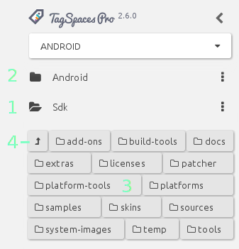
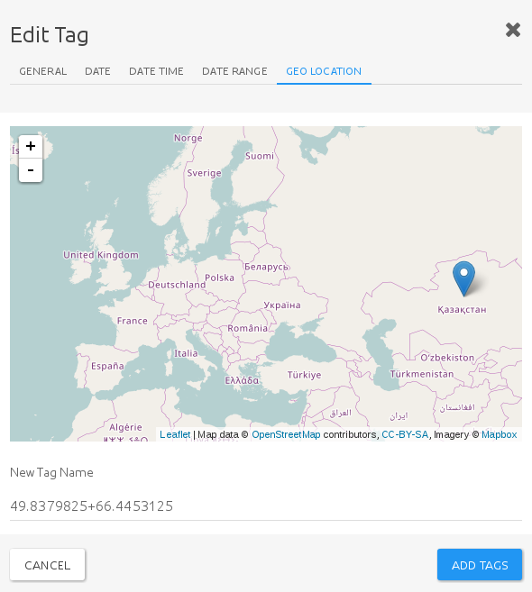

# User Interface

## Start screen

TagSpaces opens up as a single-window application that tries to make the best use of any space available, be it large wide screens, or small mobile displays. The user interface, devised along the guidelines of Google's material design specifications, is very adaptable. The application will look the same, regardless of the operating system, or platform it runs under.

This streamlined experience offers familiarity and an ease to use the application across platforms, while you will need to familiarize yourself with its extensive features only once. The following screen shows a typical start screen of TagSpaces with an open tag library, and showing a folder's content with the [**list perspective**](/extensions/perspectiveList.html) extension.

The user interface of the application consists of the following main areas:

* [Location management dropdown](#location-manager) - located below the TagSpaces logo
* [Folder navigator area](#folder-navigation) - located at the leftmost area of the user interface
* [Tag library area](#tag-library) - located at the leftmost area of the user interface (replaces the folder navigator, when active)
* [File browser area](browsing-files.html) - located in the main area of the user interface
* [File content area](viewing-files.html) - if a file is opened, the main area splits into two panes. The file viewer will occupy the right pane, while the left will be preserved for the file browser.
* [Floating action button](#floating-action-button)  - A contextually aware action button to access different available actions

## Location manager
A **location** is a folder on your local file system, which will serve as a root for listing subfolders, files and documents. Typical locations are for example the folder where you collect your photos or folders where you store your documents, ebooks or music.

> **Hint:** Do not choose very large directories such as your *home folder* as a location root folder, as this may lead to performance issues.

The **location manager** is implemented as a dropdown menu, which allows you to switch very quickly between different locations. Once opened, you will see a list of the currently connected locations. Here you can select any location, or access its properties, by clicking the pencil icon next to its name. You can add new locations, by clicking on the **Connect new location** button.

In the **edit location dialog** you can update the name of the location or change the path to the root folder. You can also select here the default [**perspective**](browsing-files.html#perspectives), used with this location. For example if the  location contains mainly images and photos, you may want to open it with the  [**image-swipper perspective**](/extensions/perspectiveImageSwipper) , offering a preview of the images and easy navigation through them.

With the *remove location* button you can remove the location permanently from TagSpaces. This operation will not affect your files, it only removes its reference from TagSpaces.

### Startup location
By default TagSpaces opens the last opened location on startup. You can change this behavior by first enabling on the option *Use default location in the as a startup location* in the general tab of the settings, then turning on the **Startup location** switch in the properties dialog of a desired startup location. The selected location will then open by default on every start of the application. The current startup location is marked by a different color in the location dropdown list.

## Folder navigation

To open the folder navigation view on the left pane, you need to click the folder icon, in the middle of the view-chooser widget at the bottom of the left panel.

### How to use navigation

Folder navigation is simple and intuitive. You will be presented with a grid-list of all the subfolders found in your location root. Clicking one of these will navigate to that folder. The current folder will now be represented as a new list item **(1)** underneath the top level folder **(2)**, with any subfolders listed as a grid at the bottom **(3)**. To navigate back, you can either click the *go to previous folder* button on the grid **(4)**, or click on a folder higher up in the list.

> **Hint:** A neat trick, that allows for a lot more advanced navigation is to list the subfolders of any folder higher up on the path, allowing you to navigate straight there. To list the subfolders of any item, click on the black folder icon, next to a folder's name.

### Folder context menu

Clicking on the *overflow* button besides folder list items, will open up a context menu, with directory operations. From here you can reload folder contents, rename or delete the folder, Add a new subfolder, or open it in your operating system's default file manager.

#### <i class="profeature">pro</i> Updating thumbnails and folder properties

TagSpaces PRO offers two more options in the context menu:

* **Update thumbnails** will refresh the thumbnail cache. TagSpaces generates non-persistent image thumbnails by default. To fully access the powerful thumbnail generating capabilities of TagSpaces PRO, you must first enable this feature from the *PRO* tab of the *Options dialog*. Once enabled, TagSpaces PRO will generate persistent thumbnail images of other files types as well, such as `PDF`, `docx`, `epub`, etc. These thumbnails offer a quick preview of the file's contents when browsing in [**Grid perspective**](/extensions/perspectiveGrid.html)

* **Directory properties** will open a a dialog, that allows you to view (but not modify) the folder path, add or edit a description and tags of the directory. To use this feature, you will need to switch on *Enable the use of a hidden folder(.ts) for storing meta data and thumbnails*  on the *PRO* tab of the options dialog.

>**Hint:** Generating thumbnails, or adding meta information to a folder will not alter the folder or its contents, only place a hidden subdirectory in it, containing the thumbnails and a `JSON` file with the meta information.

### Alternative folder navigation
An alternative to the left panel folder navigation view is the interactive path on top of the file browsing area. In case you have closed the left panel of the application or you are on a mobile or other small screen device, this might be a more convenient way to navigate a folder structure.

Clicking on a folder in the alternative navigator will open a context menu, where you can execute some basic folder operations and navigate to any subfolders located in the selected folder. This means, if you need to navigate back to a folder, using the interactive path, you should select its parent folder, and select the desired folder from the options menu.

## Tag Library

To open the **tag library** view on the left pane, you need to click the tag icon, on the left of the view-chooser widget at the bottom of the left panel.

> **Hint** You can easily open the tag library by the following keyboard combination `s t` (Press the keys `s`, then `t` in quick succession.) The shortcut stands for "show tags". The key combination `s f` will change back to folder navigation ("show folders")

### Tags in TagSpaces

The primary purpose of TagSpaces, is tagging files and organizing them. **Tags** are organic and integral parts of TagSpaces. By default, tags are stored as part of the filename, which makes them easily transferable between file and operating systems, without any need to synchronize databases, or do any extra work. A file can organically hold its own tags, as long as changing the filename is permittable.

><i class = "profeature">pro</i> **Hint** In TagSpaces PRO, you have the option to use a hidden file (a so called sidecar file) to store tags related information. This can be useful when you are not able, or not allowed to change filenames, such as with a development project, or working collaboratively on shared documents.

Tags can be anything, form descriptive labels, to categories, ratings, priorities, or dates, timestamps, and smart tags.

> **Hint:** To learn more about the powerful tag management features TagSpaces offers, read the [Tagging section](tagging.html)

### Tag groups

Tags are organized into **tag groups**, which are basically categories for tags with similar purpose and/or characteristics. Tag groups make it easier to navigate, select and manage tags in the system. TagSpaces comes with a few pre-defined tag groups, which you can freely modify, delete, or expand upon. The default tag groups are:

* **Common Tags**: This group contains two predefined tags, *book*, and *paper*. This can give you a general idea of the intended purpose of the group.

* **Getting Things Done**: Another useful category that can enhance your productivity, is an implementation of the [GTD time management method](https://en.wikipedia.org/wiki/Getting_Things_Done). Predefined tags here are *done*, *next*, *maybe* and *waiting*.

* **Smart tags** include various date based tags and geo-tagging.
    * **Time and date tags** are timestamps textual representations, such as *now*, *today*, *tomorrow*, etc. Applying one of these tags to a file will add a timestamp, corresponding to your choice of smart tag. A timestamp has the format of `YYYMMDD~hhmmss`. Tagging a file with e.g. *now* would apply the full timestamp down to the second, while tagging e.g. *month* would tag it with a subset like `YYYYMM`. Smart tags have a distinguishing blue background, which they only retain in the tag library.
    * <i class="profeature">pro</i> Applying a **geo tag**, an additional feature in TagSpaces PRO, opens up a dialog with an interactive map, where you can drop a pin. The geo-location (longitude and latitude coordinates), will be added to the selected file as a tag.

    

* **Priorities** are exactly what they seem. These are color coded tags that will be easily identifiable by a simple glance. The three predefined priority tags are:
    * *high* - dark orange background
    * *medium* - orange background
    * *low* - lime background

* **Ratings** are predefined star-rating tags with an identifiable yellow background. As the `*` (asterix) character is considered a 'wildcard' on most file systems (meaning you cannot use it in filenames), giving a star rating as a filename-based tag would be somewhat difficult. With the yellow "rating" tags this problem can be easily solved, so your files can be organized in a rating-based system.

* **Collected Tags** is a group for all other tags you have given to your files that do not belong to any other group. This includes the actual timestamps placed on a file by applying smart tags.

> **Hint:** when you delete the *Collected Tags* tag group, it will be automatically recreated as soon as you add a new tag. This will however remove all uncategorized tags form the tag library, making any such tags that are already added to files, orphaned.

Tag groups can be expanded or closed, for a more uncluttered interface, by clicking on the tag-group's name. A little badge-icon next to the tag group's name shows the number of tags contained in that group. This can be useful, when the tag group is closed.

### Create or import tag groups

To create a new tag group, click on **Create Tag Group**, right underneath the tag groups. This will bring up a dialog, that will allow you to specify a name for your tag group, and the color of tags that belong to that group. color coding tags groups can help to easily distinguish between tags belonging to the same group, or otherwise share common characteristics. You can also specify the text color for the tags, which can be useful when choosing a lighter or darker background, so that the name can contrast.

Selecting the **Import tags** option will allow you to import predefined predefined tags, which you have previously created in TagSpaces. This option takes a `JSON` file, previously exported from (probably another instance of) TagSpaces, and imports all the tags contained within, into your system. This can be useful, when you use TagSpaces on multiple systems, or you work collaboratively with others and wish to share the same tags library. To learn more about sharing tags between systems and people, refer to the [Sharing tag libraries](/tutorials/sharing-tags.html) tutorial article.

### The tag context menu

Each tag also offers its own context menu, accessible by clicking or right clicking on the tag. The displayed context menu will be slightly different depending on whether you've accessed it from the left panel tag library, or form a tag that is already added to a file. When accessed from the left panel, you will be presented with four options:

* **Tag selected files**  -  which will allow you to apply a tag to any number of files selected, at once
* **Show Files With This Tag**  -  is essentially a tag filter you can apply, so that only files that have the selected tag applied to them, will show.
* **Edit tag**  -  will let you change the tag's name, or background color and text color, and key bindings.
* **Delete tag**  -  will remove the tag form the library

**Hint:** You can add key-bindings to any tag. Key bindings are essentially a key combination that allows you to quickly mark a file with the tag in question. just select the file, press the key combination, and the file will be marked.

Key-bindings can be either key combinations, like e.g. `ctrl+a`, which mean you should press these keys simultaneously; or repeated keystrokes, like `e t`, which means you should press these keys in quick succession. Tags that have key bindings will be marked with a little keyboard icon (⌨) in th tag library.

When accessing a tag's context menu from the **file browsing area** (the main area of the User Interface), any modifications will only apply to the tag on the selected file, and **not** to the tag as contained in the tag library. This context menu will still allow you to filter, edit, or remove the tag, and also offer to change its position among the other tags applied to the selected file, moving it left or right.

> **Hint:** Editing the name of a tag deleting one from the library tags will only affect the library itself. If the same tag had had already been applied to a file, the tag on that file will remain intact. But if you change the color of a tag in the library, it will be reflected on the files marked with that tag as well. This is because of the way TagSpaces handles tags, that essentially become an organic part of the filename.  To learn more about how tagging works, please refer to [File tagging based on filename](tagging.html#file-tagging-based-on-filename) under the Tagging section.

### The tag group context menu

Tag groups have their own context menu, accessible by clicking the overflow icon next to the tag group's name. The context menu offers the following options and operations:

* **Add tags** - This will open a very simple dialog, allowing to add new tags to the group. You can add more than one tag at once, separating them with commas, like `tag1, tag2, tag3, tag4`
* **Move Tag Group Up** and **Move tag Group Down** will allow you to change the tag group's position among other groups.
* **Edit tag Group** will let you change the tag group's name, the default tag background, and tag text colors.
* **Sort Tag group** will sort all tags inside the group alphabetically. Useful after having manually added a number of tags.
* **Delete tag group** - will remove the tag group from the library, with all the tags contained within.

> **Hint:** Learn more about how to change the default tag background and text colors in the [settings documentation](#settings) section below.

## File browsing and preview

The file browsing area normally takes up he majority of the user interface. This is where all files from the currently active folder are displayed, either as a list, grid, or folder tree, depending on the active [**perspective**](browsing-files.html#Perspectives). To learn more about the all file browsing features, navigate to the [File Browsing Section](browsing-files.html).

When a file is opened, the main UI area splits into two, the rightmost page becoming the **file preview area**. TagSpaces is capable of natively displaying different file types, from markdown, through HTML and docx, to PDF, epub, or images files. To learn more about all the viewable and editable files, and tagSpaces's full file handling capacity, navigate to the [Viewing Files section](viewing-files.html)

## Floating Action Button

At let lower right corner of the interface, you will find a **Floating Action Button** (or FAB), first introduced in Google's material design specification. The FAB you find TagSpaces slightly differs from he original material idea, inasmuch as it does not only allow a single action to be performed, but rather houses an overflow menu, which opens a contextually aware dialog. What the dialog offers depends on what is currently open, or what view the focus is on. The various menu options of the FAB overflow menu will be discussed in more detail, where relevant.
