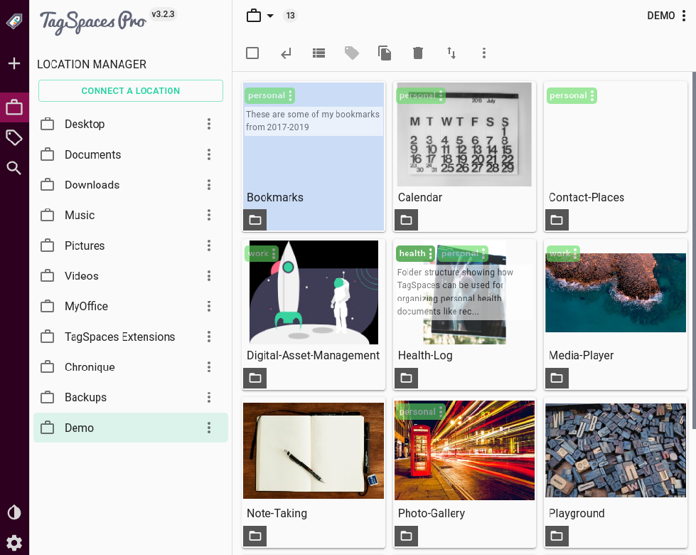

# User Interface

## Start screen
The following screen shows a typical start screen of TagSpaces with an opened tag library and showing a folder content with the list perspective extension.

The user interface of the application consists of the following major areas:

* [Location management dropdown](#location-manager) - located bellow the tagspaces logo
* [Folder navigator area](#folder-navigation) - located in the left area of the user interface
* [Tag library area](#tag-library) - located in the left area of the user interface 
* [File browser area](browsing-files.html) - located in the center area of the application
* [File content area](viewing-files.html) - if a file is opened, the file viewers is opened on the right part of the user interface
* [Settings dialog](#settings) - started by the gear-wheels button in the bottom left part of the user interface 

## Location manager
A **location** is a folder on your local drive, containing files and other folders. Typical locations are for example folder where you collect your photos or folders where you store your documents, ebooks or music.  

> **Hint:** Do not choose very large directories such as your *home folder* as a location root folder, because this may lead to performance issues.

The location manager is implemented as a dropdown, which is allowing you to switch very quickly between different locations. Once opened you will see a list of the currently connected locations. Here you can access the properties of every location, by simply clicking on the button with the pencil icon. You can also add here new locations, by clicking on the **Connect new location** button.

 

In the location properties you can update the name of the location or change the path to the root folders. You can also select here a perspective, which should open by default on switching to this location. For example on location containing mainly images and photos, you may want to open with [image-swipper](/extensions/perspectiveImageSwipper) perspective, offering a preview of the images and easy navigation through them. 

With the *remove location* button you can remove the location permanently from TagSpaces. This operation will not delete your files, but just the connection to them in TagSpaces.

### Startup location
By default TagSpaces opens the last opened location on startup. You can change this behaviour by switching the switch **Startup location** in the location properties dialog. It will make this location to open by default on every start of the application. The current startup location is marked with other color in the location dropdown list. In order to activate this functionality you have to switch the option *Use default location in the as a startup location* in the general tab of the settings. 

## Folder navigation
TODO
* Opening the navigation
* General description
* Explaining the context menu, with the operations

### Alternative folder navigation 
Navigation through folder is an essential use case of TagSpaces, that's we have provided an alternative way of doing this operation, in case you have closed the left panel of the application or you are on a mobile device.

Clicking on a folder in the alternative navigator will open a context, where you can execute some basic folder operations and navigate to some sub folder.

### Go to previous folder button
Other convenient feature is the so called "go to previous folder" button in the folder navigation area. Which for example can be used to leave your current location and browse files in parent folder of a given location.

## Tag Library
TODO
* Open the tag library
* Clarifying tag and tag group terms
* Creating and importing tag groups
* Explaining the context menu of a tag
* Explaining the context menu of a tag group (sorting and other functionalities)

> **Hint** You can easily open the tag library by the following keyboard combination `s t`.

> **Hint:** Find out how to change the default tag background and text colors in the [settings documentation](#settings)

## Settings
The setting of the application can be opened from the button with gear-wheels in the bottom of the left area, as displayed in the following screenshot. Alternatively you can use the main menu `View > Settings`.

TODO
* Explaining all the functionalities in the general tab of the settings

