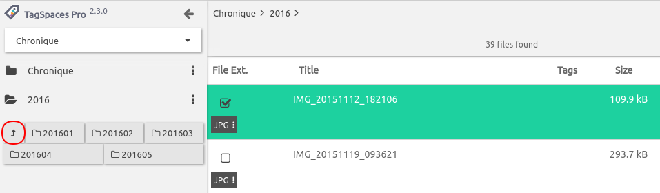

# User Interface

## Homescreen

## File previewing

The application supports previewing of many file types directly. It has a basic build in [Image](/extensions/viewerImage), [PDF](/extensions/viewerPDF), [EPUB](/extensions/viewerEPUB), [ZIP](/extensions/viewerZIP), [URL](/extensions/viewerURL), [Audio and Video](/extensions/viewerAudioVideo) and [Text](/extensions/editorText) viewers. TagSpaces is designed with extensability in mind so any other kind of file viewers can developed and integrated easily.

### Color coded extensions
In this version we added some more colors to application. For the most common file extension we defined a custom color for extension buttons in the different perspectives. In the following screenshot, you can see the colored extensions in the list perspective.

Of course you can switch this feature off. Just go to the general tab of the settings and disable the *Enable colored file type extensions* checkbox. In the future we are planing to make the colors for the extensions configurable.

## Source code browser and editor
The text editor supports source code highlighting for many common programming languages. This in combination with the build in [JSON editor](/extensions/editorJSON) makes the application a good source code navigator with basic editing capabilities. The intention here is not to makes TagSpaces your next IDE, but rather to give your quick overview of soure code repositories.

## Generating live thumbnails for photos

In the Grid and ImageSwiper perspectives TagSpaces generates thumbnails for JPG and PNG files on fly. These small image previews are not persisted on your system, so every time you open a folder they will be regenerated. TagSpaces generates thumbnails only for image files which are currently visibile in the application.

## Tag Management

Moving the *Import tags* and *Create tag group* buttons from the tag group menu to the tag library area.

## Go to previous folder
Other convenient feature we implemented is the so called "go to previous folder" button in the folder navigation area. Which for example can be used to leave your current location and browse files in parent folder of a given location.

