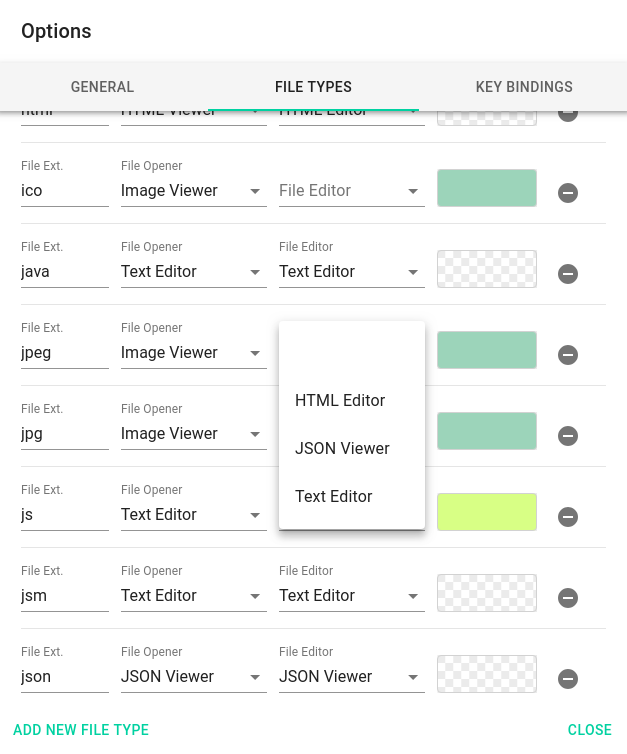

# View your files

## File previewing

The application supports previewing of many file types without the need of external viewer. It comes with the following viewer extensions:

* [Audio Video Player](extensions/viewerAudioVideo.html)
<!-- * [EPUB Reader](extensions/viewerEPUB.html)-->
* [HTML Reader](extensions/viewerHTML.html)
* [Image Viewer](extensions/viewerImage.html)
* [Link Opener](extensions/viewerURL.html)
* [Markdown Reader](extensions/viewerMD.html)
* [MHTML Reader](extensions/viewerMHTML.html)
<!--* [ODF Viewer](extensions/editorODF.html)-->
* [PDF Viewer](extensions/viewerPDF.html)
* [Text Reader](extensions/viewerText.html)
* [Simple Viewer](extensions/viewerBrowser.html)
* [ZIP Opener](extensions/viewerZIP.html)

TagSpaces is designed with extensibility in mind so any other kind of file viewers can developed and integrated easily.

## Source code browser and editor (use case?)
The text editor supports source code highlighting for many common programming languages. This in combination with the build in [JSON editor](/extensions/editorJSON.html) makes the application a good source code navigator with basic editing capabilities. The intention here is not to makes TagSpaces your next IDE, but rather to give your quick overview of source code repositories.

## Assigning file type to an extensions

## Printing files
The majority of the viewer extensions has tha ability to print the opened files, thanks to the build in print functionality. In the following short video, you can see how you can start the printing.

